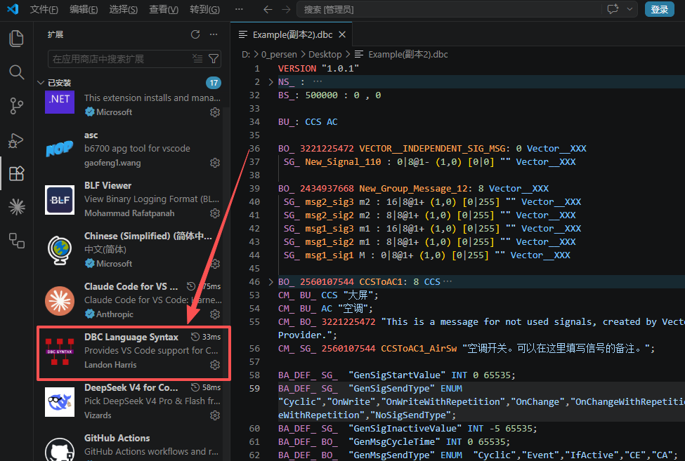

# 一文带你搞懂DBC文件格式

## DBC是什么？

一辆现代汽车上有几十个 ECU（电子控制单元）——发动机控制器、变速箱控制器、车身稳定系统、空调面板、车门模块……它们在一条 CAN 总线上以每秒几百上千帧的速度互相通信。但 CAN 总线只负责传输原始数据：一帧数据就是一个 ID 加 8 个字节的 payload。如果没有说明书，你看到的永远是"ID 0x123 发了 `00 1A FF 03 00 00 00 00`"——这八个十六进制数到底代表什么？车速？发动机转速？还是某个开关的状态？

DBC（Database CAN）文件就是这个说明书。它用一套标准化的文本格式，把 CAN 总线上每一帧报文的每一个信号都描述得清清楚楚：这是什么物理量、占哪几个 bit、怎么换算成工程值、单位是什么、发给谁看。有了 DBC 文件，任何工具和开发者都能用同一套规则去解读 CAN 总线上的数据，不再需要人对人传话、文档对文档吵架。

一个 DBC 文件里主要定义了三层东西：

| 层级 | 对应概念 | 说明 |
|---|---|---|
| **报文（Message）** | 一帧 CAN 数据 | 定义报文 ID、名称、长度（DLC）、发送节点、周期 |
| **信号（Signal）** | 报文里的一个数据字段 | 定义起始位、长度、字节序、缩放系数、偏移量、单位、值域 |
| **节点（Node）** | 总线上的一个 ECU | 定义哪些节点发送哪些报文、接收哪些报文 |

这三层关系是嵌套的：一个节点收发多条报文，一条报文包含多个信号，每个信号对应一个物理量。DBC 文件本质上是这个三层结构的**唯一事实来源（Single Source of Truth）**——软件工程师根据它写通信代码，测试工程师根据它搭建仿真环境，诊断工具根据它解析车辆故障。整个 CAN 网络的协同开发，都建立在 DBC 文件之上。

## DBC应用场景

`DBC` 文件不是写完就放一边的文档——它是能被工具直接消费的**机器可读的通信协议**。这就意味着它可以嵌入到开发和测试的自动化链路里。三个最核心的应用场景：

**自动代码生成**

手写 `CAN` 通信代码有两个问题：一是报文多了容易出错（几百个信号，哪个在哪个报文里、从第几位开始、`Motorola` 还是 `Intel` 格式，纯人脑记不住），二是协议一旦更新，代码和 `DBC` 不一致就是 `bug`。成熟的工具链（如 `Vector` 的 `GENy`、`ETAS` 的 `RTA` 系列）可以直接读取 `DBC` 文件，自动生成 `ECU` 的通信栈代码——发送报文的打包函数、接收报文的解包函数、信号的缩放换算逻辑——全部由工具保证和 DBC 一致。

**系统测试与仿真**

测试 CAN 通信能不能脱离真实硬件？不仅要能，而且是常态。`HIL`（硬件在环）测试平台和 `CANoe`、`CANalyzer` 这类工具直接加载 `DBC` 文件，就能把二进制报文解析成有意义的信号名和工程值。更关键的是**剩余总线仿真**——你要单独测一个 `ECU`，但总线上其他节点不存在。工具根据 `DBC` 文件来模拟那些"假"节点按协议发报文，你的被测 `ECU` 完全不知道自己在跟仿真器聊天。

**车辆诊断**

诊断仪插上 `OBD` 口，怎么知道读回来的故障码代表什么？怎么知道 0x180 报文第 3 字节是冷却液温度还是机油压力？诊断工具加载 DBC 后，无需人工查表即可直接将原始 hex 映射为诊断参数名称和物理值。

> DBC 文件的价值不在文件本身——在于它让**一整车的人用同一套语言说话**。整车厂、Tier 1 供应商、测试团队、诊断团队，所有人读的是同一份 DBC。协议改了一个信号的 scaling factor？更新 DBC，所有环节同步生效。

## DBC文件格式详解

DBC的文件格式参考了vector官方的 《[DBC_File_Format_Documentation.pdf](https://github.com/shilic/shilic.github.io/blob/main/src/posts/%E6%B1%BD%E8%BD%A6%E7%94%B5%E5%AD%90/DBC/assets/DBC_File_Format_Documentation.pdf)》 文件， 里边非常清晰的讲解了每一个字段应该如何填写。

文件链接：[https://github.com/shilic/shilic.github.io/blob/main/src/posts/汽车电子/DBC/assets/DBC_File_Format_Documentation.pdf](https://github.com/shilic/shilic.github.io/blob/main/src/posts/汽车电子/DBC/assets/DBC_File_Format_Documentation.pdf) 点击即可下载查看

### DBC文件示例

  
点击查看DBC文件示例

<pre style="background:#282c34;color:#abb2bf;padding:1.2em 1.5em;border-radius:6px;overflow-x:auto;font-size:0.9em;line-height:1.7;font-family:'JetBrains Mono','Fira Code','Cascadia Code',Consolas,monospace;">VERSION "1.0.1"  NS_ : &#9;NS_DESC_ &#9;CM_ &#9;BA_DEF_ &#9;BA_ &#9;VAL_ &#9;CAT_DEF_ &#9;CAT_ &#9;FILTER &#9;BA_DEF_DEF_ &#9;EV_DATA_ &#9;ENVVAR_DATA_ &#9;SGTYPE_ &#9;SGTYPE_VAL_ &#9;BA_DEF_SGTYPE_ &#9;BA_SGTYPE_ &#9;SIG_TYPE_REF_ &#9;VAL_TABLE_ &#9;SIG_GROUP_ &#9;SIG_VALTYPE_ &#9;SIGTYPE_VALTYPE_ &#9;BO_TX_BU_ &#9;BA_DEF_REL_ &#9;BA_REL_ &#9;BA_DEF_DEF_REL_ &#9;BU_SG_REL_ &#9;BU_EV_REL_ &#9;BU_BO_REL_ &#9;SG_MUL_VAL_  BS_: 500000 : 0 , 0  BU_: CCS AC  BO_ 3221225472 VECTOR__INDEPENDENT_SIG_MSG: 0 Vector__XXX  SG_ New_Signal_110 : 0|8@1- (1,0) [0|0] "" Vector__XXX  BO_ 2434937668 New_Group_Message_12: 8 Vector__XXX  SG_ msg2_sig3 m2 : 16|8@1+ (1,0) [0|255] "" Vector__XXX  SG_ msg2_sig2 m2 : 8|8@1+ (1,0) [0|255] "" Vector__XXX  SG_ msg1_sig3 m1 : 16|8@1+ (1,0) [0|255] "" Vector__XXX  SG_ msg1_sig2 m1 : 8|8@1+ (1,0) [0|255] "" Vector__XXX  SG_ msg1_sig1 M : 0|8@1+ (1,0) [0|255] "" Vector__XXX  BO_ 2560107544 CCSToAC1: 8 CCS  SG_ CCSToAC1_FactoryID : 0|8@1+ (1,0) [0|255] ""  AC  SG_ CCSToAC1_AirSw : 8|2@1+ (1,0) [0|3] ""  AC  SG_ CCSToCabin1_ColdGearReq : 10|4@1+ (1,0) [0|15] ""  AC  SG_ CCSToAC1_FanGearReq : 14|4@1+ (1,0) [0|15] ""  AC  SG_ heart : 56|8@1+ (1,0) [0|255] ""  AC  CM_ BU_ CCS "大屏"; CM_ BU_ AC "空调"; CM_ BO_ 3221225472 "This is a message for not used signals, created by Vector CANdb++ DBC OLE DB Provider."; CM_ SG_ 2560107544 CCSToAC1_AirSw "空调开关。可以在这里填写信号的备注。";  BA_DEF_ SG_  "GenSigStartValue" INT 0 65535; BA_DEF_ SG_  "GenSigSendType" ENUM  "Cyclic","OnWrite","OnWriteWithRepetition","OnChange","OnChangeWithRepetition","IfActive","IfActiveWithRepetition","NoSigSendType"; BA_DEF_ SG_  "GenSigInactiveValue" INT -5 65535; BA_DEF_ BO_  "GenMsgCycleTime" INT 0 65535; BA_DEF_ BO_  "GenMsgSendType" ENUM  "Cyclic","Event","IfActive","CE","CA"; BA_DEF_ BO_  "GwUsedMsg" ENUM  "No","Yes"; BA_DEF_ BO_  "DiagState" ENUM  "No","Yes"; BA_DEF_ BO_  "NmMessage" ENUM  "No","Yes"; BA_DEF_ BU_  "NmStationAddress" HEX 0 255; BA_DEF_  "DBName" STRING ; BA_DEF_  "BusType" STRING ;  BA_DEF_DEF_  "GenSigStartValue" 0; BA_DEF_DEF_  "GenSigSendType" "Cyclic"; BA_DEF_DEF_  "GenSigInactiveValue" 0; BA_DEF_DEF_  "GenMsgCycleTime" 200; BA_DEF_DEF_  "GenMsgSendType" "Cyclic"; BA_DEF_DEF_  "GwUsedMsg" "No"; BA_DEF_DEF_  "DiagState" "No"; BA_DEF_DEF_  "NmMessage" "No"; BA_DEF_DEF_  "NmStationAddress" 0; BA_DEF_DEF_  "DBName" "诚"; BA_DEF_DEF_  "BusType" "CAN";  BA_ "DBName" "Example"; BA_ "NmStationAddress" BU_ CCS 10; BA_ "NmStationAddress" BU_ AC 11; BA_ "NmMessage" BO_ 2560107544 0; BA_ "DiagState" BO_ 2560107544 0; BA_ "GwUsedMsg" BO_ 2560107544 0; BA_ "GenMsgCycleTime" BO_ 2560107544 500; BA_ "GenMsgSendType" BO_ 2560107544 1;  BA_ "GenSigStartValue" SG_ 2560107544 CCSToAC1_AirSw 0; BA_ "GenSigStartValue" SG_ 2560107544 CCSToCabin1_ColdGearReq 0; BA_ "GenSigStartValue" SG_ 2560107544 CCSToAC1_FanGearReq 0; BA_ "GenSigStartValue" SG_ 2560107544 heart 0;  VAL_ 2560107544 CCSToAC1_AirSw 0 "预留" 1 "关闭" 2 "开启" 3 "无效值未使用" ; VAL_ 2560107544 CCSToCabin1_ColdGearReq 0 "等级零" 1 "等级一" 2 "等级二" 3 "等级三" 4 "等级四" ; VAL_ 2560107544 CCSToAC1_FanGearReq 0 "等级零" 1 "等级一" 2 "等级二" 3 "等级三" 4 "等级四" ;  </pre>

### `VSCode`插件

安装`VSCode`，并安装`DBC Language Syntax`插件，即可在`VSCode`中语法高亮的显示DBC中的信号。并且还自带语法纠错功能，如果DBC语法出错了之后，还会以红色波浪线显示该错误。建议相关的技术人员都去安装该插件。

### DBC文件结构

按照vector官方的 《[DBC_File_Format_Documentation.pdf](https://github.com/shilic/shilic.github.io/blob/main/src/posts/%E6%B1%BD%E8%BD%A6%E7%94%B5%E5%AD%90/DBC/assets/DBC_File_Format_Documentation.pdf)》 文件所说，DBC文件的结构必须按照固定的顺序排列，我这里挑了一些重点进行介绍，如下所示，感兴趣的可以自己下载原文进行查看：

- version : 版本
- new_symbols : 新符号
- bit_timing (*obsolete but required*): 波特率(必须有，但可以不填)
- nodes: 所有节点
- messages: 报文及信号
- message_transmitters: 报文传输节点
- comments: 注释
- attribute_definitions: 自定义属性的定义
- attribute_defaults: 自定义属性的默认值
- attribute_values: 自定义属性的值
- value_descriptions: 值描述

下边我将依次讲解这些部分

### version : 版本

### new_symbols : 新符号

### bit_timing: 波特率

### nodes: 所有节点

### messages: 报文及信号

### message_transmitters: 报文传输节点

### comments: 注释

### attribute_definitions: 自定义属性的定义

### attribute_defaults: 自定义属性的默认值

### attribute_values: 自定义属性的值

### value_descriptions: 值描述

