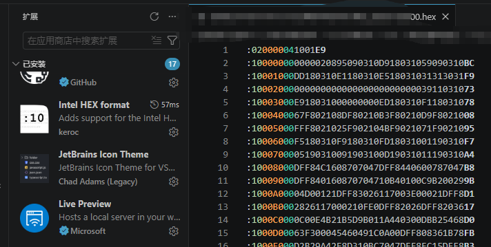

# 一文带你搞懂Hex文件（Intel HEX）

上一篇文章讲了 S19 文件，本文继续聊另一种常见的十六进制格式——Intel HEX，简称 Hex。同样是在 UDS 刷写中打交道最多的文件格式之一。

感兴趣的可以直接移步上一篇：[一文带你搞懂S19文件](https://shilic.github.io/posts/汽车电子/UDS/UDS刷写文件/一文带你搞懂S19文件.html)

## 一、概述

Hex 文件是 Intel 公司定义的一种按地址排列的数据格式，数据宽度为字节，所有数据用十六进制数字表示，以 `ASCII` 码形式按行存储。每一行以冒号 `:` 开头，表明一条记录的开始。

它和 S19 的本质区别就两点：**起始符不同**（`:` vs `S`），**字段排列顺序不同**。除此之外的思想完全一致——都是"文本格式的二进制数据 + 地址 + 校验"。

说起来也挺有意思——嵌入式世界的大端小端之争是 Intel 和 Motorola 搞出来的，结果到了程序文件格式这儿，又是这俩公司各自搞了一套：Intel 搞了 HEX，Motorola 搞了 S-Record。两家巨头从字节序打到文件格式，谁也不服谁，倒是给我们写底层工具的人留下了不少"兼容适配"的活。

## 二、Hex 文件示例

先用一个真实的 Hex 文件片段感受一下：

: 020000041001E9

: 100000000000020895090310D918031059090310BC

: 10001000DD180310E1180310E518031031313031F9

: 100020000000000000000000000000003911031073

: 10003000E918031000000000ED180310F118031078

: 1000400067F802108DF80210B3F80210D9F8021008

: 10005000FFF8021025F902104BF9021071F9021095

在 `VSCode` 中安装 `Hex Editor` 或 `Intel HEX format` 插件，可以高亮显示各字段，方便快速查看每一个部分。如下图所示

## 三、Hex 文件格式结构

每条记录的结构固定，以冒号 `:` 打头，后面跟着五段信息：

: BB AAAA TT HHHHHHHH... CC

用颜色标注如下（以上面第二行为例）：

: 10 0000 00 0000020895090310D918031059090310 BC

| 字段 | 颜色 | 含义 | 本例 |
|------|------|------|------|
| 起始符 | — | 固定 `:` | **:** |
| 数据长度（Byte Count） | 🔵 蓝 | 本行数据字节的个数（`HH` 的个数） | 10 = 16 字节 |
| 地址（Address） | 🟢 绿 | 数据起始地址（2 字节），根据记录类型不同，可能有不同的含义 | 0000 = `0x0000` |
| 记录类型（Record Type） | 🔴 红 | 本行记录类型，包含5个种类，不同种类包含不同数据 | 00 = 数据记录 |
| 数据（Data） | 🟠 橙 | 实际数据，长度由"数据长度"字段决定 | 00000208950903... |
| 校验和（Checksum） | 🟣 紫 | 校验和 = 0x100 - 前面字节累加和(溢出byte部分不计) | BC |

下边我会详细展开讲每一个字段。

## 四、Hex 行字段说明

### 数据长度（Byte Count）

1字节十六进制数，表示本行**数据字段**(橙色字节)的字节数。注意：不包括地址和记录类型字段。

以 : 10 0000 00 0000020895090310D918031059090310 BC 为例：0x10 = 16，表示后面跟了 16 个字节的数据。

### 地址（Address）

2字节十六进制数，表示本条数据的**偏移地址**（16 位范围，`0x0000 ~ 0xFFFF`）。

例如 : 100000000000020895090310D918031059090310BC 中的 0000 。

根据记录类型不同有不同含义。——后面会详细讲。

### 记录类型（Type）

以 : 100000000000020895090310D918031059090310BC 为例，其中的红色部分 00 就是HEX文件的记录类型

1字节十六进制数，Hex 共有 6 种记录类型：

| 类型 | 名称 | 用途 |
|------|------|------|
| `00` | 数据记录（Data Record）(8-, 16-, or 32-bit formats) | 存实际数据，最常见 |
| `01` | 文件结束（End of File Record）(8-, 16-, or 32-bit formats) | 标识文件结束，后面没有数据了 |
| `02` | 扩展段地址（Extended Segment Address Record）(16-or 32-bit formats) | 基地址 = 数据值 << 4 |
| `03` | 起始段地址（Start Segment Address Record）(16-or 32-bit formats) | 指定程序起始段地址（极少用）（网上关于该记录类型的描述很少，具体作用不详） |
| `04` | 扩展线性地址（Extended Linear Address Record）(32-bit format only) | 基地址 = 数据值 << 16（最常见扩展方式） |
| `05` | 起始线性地址（Start Linear Address Record）(32-bit format only) | 开始线性地址记录，即:程序入口地址(程序入口地址未必是main函数地址)（如复位向量） |

下面逐个展开每一种类型。

#### 类型 00 —— 数据记录（Data Record）(8-, 16-, or 32-bit formats)

| Record Mark ':'   | Record Length | Load Offset | Record Type '00' | Data   | Checksum |
| ----------------- | ------------- | ----------- | ---------------------------------------------------- | ------ | -------- |
| 1 Byte 固定为 ':' | 1 Byte        | 2 Byte      | 1 Byte 固定为 00 | N Byte | 1 Byte   |

最常出现的一类，后跟实际要烧录到 Flash 中的数据：

: 10 0010 00 DD180310E1180310E518031031313031 F9

- 10：16 字节数据
- 0010：偏移地址 = `0x0010`
- 00：数据记录
- DD180310E1180310E518031031313031：16 字节实际数据
- F9：校验和

#### 类型 04 —— 扩展线性地址（常见）

| Record Mark ':'   | Record Length '02' | Load Offset '0000' | Record Type '04' | Base Address  | Checksum |
| ----------------- | ------------------------------------------------------ | ------------------------------------------------------ | ------------------------------------------------------------ | ------------- | -------- |
| 1 Byte 固定为 ':' | 1 Byte 固定为 02   | 2 Byte 固定为 0000 | 1 Byte 固定为 04 | 2 Byte 基地址 | 1 Byte   |

当程序地址超过 16 位（大于 `0xFFFF`）时，用这个类型声明高位基地址：

: 02 0000 04 1001 E9

- 02：2 字节数据
- 0000：地址字段不用，填 0
- 04：记录类型为扩展线性地址
- 1001：`04`的数据段专门表示基地址; 基地址数据 = `0x1001`
- E9：校验和

这条记录的意思是：**后面所有数据记录的物理地址 = `0x1001 << 16` + 数据记录的偏移地址**。

✍  🔶**地址计算规则** 🔷

这里就是hex文件和s19文件不同的地方，s19文件，一行数据本身就包括了全部的地址，例如 S309000080040000812CC5中的00008004就是完整地址。

而hex文件，虽然一行数据也包含了地址，但不是全部的地址，例如: 1000000000000208...BC 的0000只是表示**偏移地址**，也就是地址的低位。要想获取实际的地址，则需要基地址左移`N`位后（`N`根据记录类型有不同值），再加上偏移地址，得到实际地址。

举例：

: 020000041001E9 &nbsp; ← 基地址 = 0x1001 << 16 = 0x10010000

: 100000000000020895090310D918031059090310BC &nbsp; ← 偏移 = 0x0000

那么这条数据记录的**实际物理地址**为： ( 0x1001 << 16 ) + 0x0000 = 0x10010000

在大端存储的处理器中，内存布局如下：

| 内存地址 | 数据 |
|----------|------|
| `0x10010000` | `0x00` |
| `0x10010001` | `0x00` |
| `0x10010002` | `0x02` |
| `0x10010003` | `0x08` |

> 扩展段地址（类型 `02`）同理，只是偏移量为 `<< 4`（段地址左移 4 位）。实际工程中类型 `04` 最常用。

一旦出现新的类型 `04` 记录，后续所有数据都改用新的基地址，直到文件结束或再次遇到新的类型 `04`。

#### 类型 05 —— 起始线性地址（程序入口）

| Record Mark ':'   | Record Length '04' | Load Offset '0000' | Record Type '05' | EIP    | Checksum |
| ----------------- | ------------------------------------------------------ | ------------------------------------------------------ | ------------------------------------------------------------ | ------ | -------- |
| 1 Byte 固定为 ':' | 1 Byte 固定为 04   | 2 Byte 固定为 0000 | 1 Byte 固定为 05 | 4 Byte | 1 Byte   |

: 04 0000 05 00000000 F7

- 04：4 字节数据
- 05：记录类型是起始线性地址
- 00000000：程序入口地址 = `0x00000000`

这个地址通常是 MCU 的复位向量地址，由编译时链接脚本决定。注意：**主函数不一定是入口地址**——芯片上电后首先跳到复位向量，再通过启动代码跳转到 `main()`。

#### 类型 01 —— 文件结束

| Record Mark ':'   | Record Length '00' | Load Offset '0000' | Record Type '01' | Checksum 'FF'    |
| ----------------- | ------------------------------------------------------ | ------------------------------------------------------ | ------------------------------------------------------------ | ---------------------------------------------------- |
| 1 Byte 固定为 ':' | 1 Byte 固定为 00   | 2 Byte 固定为 0000 | 1 Byte 固定为 01 | 1 Byte 固定为 FF |

每一份有效的 Hex 文件都必须以这一行结尾：

: 00 0000 01 FF

- 00：数据长度为 0（没有数据）
- 01：记录类型为文件结束标识
- FF：因为数据是固定的，所以校验和固定 = `0x100 - 0x01 = 0xFF`

### 校验和（Checksum）

校验和方法：将冒号 `:` 之后的所有字节（数据长度 + 地址 + 记录类型 + 所有数据字节 + 校验和本身）以单字节累加，和应为 `0x00`（模 256，溢出部分不计）。

反算校验位的方法：

> 校验和 = `0x100 - (数据长度 + 地址 + 记录类型 + 所有数据字节) 的低 8 位`

验证上面那行 : 100000000000020895090310D918031059090310BC：

- 累加（除冒号外所有字节）：`10 + 00 + 00 + 00 + 00 + 00 + 02 + 08 + 95 + 09 + 03 + 10 + D9 + 18 + 03 + 10 + 59 + 09 + 03 + 10 + BC`
- 求和 = `0x300`（十六进制），低 8 位 = `0x00`
- 结果为 `0x00`（模 256 之后）= 校验通过 ✅

## 五、S19 与 Hex 对比

| | S19（S-Record） | Hex（Intel HEX） |
|------|------|------|
| 起始符 | `S` | `:` |
| 地址位数 | 由类型决定（S1=16位, S2=24位, S3=32位） | 固定 16 位 + 扩展地址（类型 04） |
| 扩展地址 | 换类型（S1→S2→S3） | 类型 `04` 声明高位 |
| 校验和 | `0xFF - 累加值` | `0x100 - 累加值` |
| 文件头 | S0 记录（可含文件名） | 无专用文件头 |
| 文件尾 | S7/S8/S9 | 类型 `01` |

两者基本等价，可以互相转换。

## 六、总结

Hex 文件的核心就是一套"带地址 + 带校验的十六进制数据流"。每一行由冒号开头，数据长度、地址、类型、数据和校验和五个字段组成，扩展线性地址记录（类型 `04`）解决了 16 位地址不够用的问题。

无论是 S19 还是 Hex，本质上都是同一件事：**用文本格式告诉编程器"把这个数据烧到那个地址"**。搞懂了一种，另一种就是换个皮。

后续我会继续更新 UDS 刷写流程的实际代码实现，包含 Python / C# 版本的 Hex 解析器。欢迎关注，一起学习交流。

## 参考链接

[单片机烧录用的hex文件，文件格式解析（转载）](https://blog.csdn.net/Bruce_Qee/article/details/119089365)

[深入理解工具链-Hex文件详解](https://blog.csdn.net/lone5moon/article/details/117792834)
