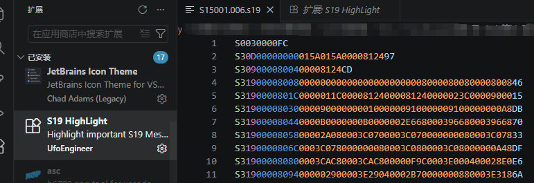

# 一文带你搞懂S19文件（S-record）

我之前做过UDS诊断上位机的开发，做过 `ECU `的 `Bootloader `刷写相关的工作。想来把知识积累一下，以便后人翻阅学习。

可以关注我，之后还会分享HEX文件的解析，以及相关的示例代码。 

## 一、概述

S19文件，也常被称为`S-Record`、`SREC`或`Motorola S-record`，是一种由摩托罗拉推出的`ASCII`文本格式，主要用于表示二进制数据。它最早被应用于嵌入式系统中的固件传输与存储，在微控制器编程、`EEPROM`烧录以及调试场景中尤为常见。这种格式以可读的文本方式编码二进制信息，并内嵌地址、数据和校验码，从而保证数据传输的可靠性。

`Motorola S-record`诞生于20世纪70年代中期，最初是为`Motorola 6800`处理器而设计。配套的开发工具会将可执行代码和数据输出为该格式，随后程序员将其读取并"烧录"到嵌入式系统中的`PROM`或`EPROM`里。

此外，还有一种常见的十六进制格式叫Intel HEX，简称Hex，是由英特尔定义的。

## 二、S19文件是什么

### S19文件示例

在正式讲解之前，我们先来看一段真实的S19文件示例。

如下边的文件所示，这是一个非常常见的S19文件片段, 我们在UDS中通过34、 36、 37 服务刷写的就是像这样的数据。

<span style="color: #e74c3c">S3</span><span style="color: #3498db">09</span><span style="color: #27ae60">00008004</span><span style="color: #f39c12">0000812C</span><span style="color: #9b59b6">C5</span>

<span style="color: #e74c3c">S3</span><span style="color: #3498db">19</span><span style="color: #27ae60">00008008</span><span style="color: #f39c12">0000000000000000000000080000800800008008</span><span style="color: #9b59b6">46</span>

<span style="color: #e74c3c">S3</span><span style="color: #3498db">19</span><span style="color: #27ae60">0000801C</span><span style="color: #f39c12">000001240000812C0000812C0000023C00009000</span><span style="color: #9b59b6">FD</span>

<span style="color: #e74c3c">S3</span><span style="color: #3498db">09</span><span style="color: #27ae60">00008120</span><span style="color: #f39c12">00000000</span><span style="color: #9b59b6">55</span>

<span style="color: #e74c3c">S3</span><span style="color: #3498db">19</span><span style="color: #27ae60">00008138</span><span style="color: #f39c12">D0012C00D101780000757060E0021C63762C0093</span><span style="color: #9b59b6">0B</span>

<span style="color: #e74c3c">S3</span><span style="color: #3498db">19</span><span style="color: #27ae60">0003B51C</span><span style="color: #f39c12">FFFF000045445249564500000000000053313530</span><span style="color: #9b59b6">6C</span>

<span style="color: #e74c3c">S3</span><span style="color: #3498db">19</span><span style="color: #27ae60">0003B530</span><span style="color: #f39c12">30312E30303600005643553032000000000000</span><span style="color: #9b59b6">89</span>

我们使用[VSCode](https://code.visualstudio.com/)打开S19文件，并添加 `S19 HighLight` 插件，即可像如下图所示，有代码块高亮，可以快速查看每一个部分在哪里。建议每个汽车工程师都下载该插件。




###  S19文件的生成方式

S19文件通常由以下工具生成：

- **编译器/链接器**：如 `GCC`、`IAR`、`Keil `等，在编译代码后生成。
- **转换工具**：通过`objcopy`（GNU工具链）将ELF或BIN文件转换为S19格式。

### S19文件的具体生成过程

假设你有这样的`C`代码：

```c
void AppMain(void);
```

编译后：

- `AppMain`这个函数被放在 Flash 的 <span style="color: #27ae60">0x00008000</span>地址上
- S19 文件里有一行： <span style="color: #e74c3c">S3</span> <span style="color: #3498db">09</span> <span style="color: #27ae60">00008000</span> <span style="color: #f39c12">......</span> <span style="color: #9b59b6">......</span>

那么以下4种东西，本质上是**同一个地址**：

| 视角     | 表示                                         |
| -------- | -------------------------------------------- |
| S19 文件 | <span style="color: #27ae60">00008000</span> |
| C 语言   | `void AppMain(void)`                         |
| CPU      | PC = `0x00008000`                            |
| Flash    | 第 `0x8000`字节开始                          |

&#x1F449; **CPU 并不关心"这是函数还是数据"**

它只看到：

- 地址
- 那里的二进制内容
- 如果内容是合法指令，就执行
- 如果内容是数据，就当作数据读

> 严格上来讲，如果你拿到别人的完整S19文件，你可以将其反编译为汇编代码。（继续反编译为C代码会很困难）

&#x1F447; **再举一个例子**

上述的文件示例中，S19文件实际上是保存的《`S15001.006.s19`》这个文件，文件名`S15001.006`就是该编译后的软件的软件版本号。

我们使用UDS的34、36、37服务刷写之后，再使用22服务去读取`0xF195`这个DID，就可以读取到刚才刷进去这个软件版本号。

我们逆向思考，既然我们刷写之后，可以通过22服务读取到更新后的`0xF195`的DID值；那么说这个刷写进去的S19文件中一定是完整保存了刚才这个字符串的。

我们将这个字符串格式的`S15001.006`软件版本号，按照ASCII码表转换为字节数组：`5331353030312E303036`, 再拿着这个到S19文件中去找，你可以找到刚才这段字节数组。

<span style="color: #e74c3c">S3</span><span style="color: #3498db">19</span><span style="color: #27ae60">0003B51C</span>FFFF0000454452495645000000000000<span style="color: #f39c12">53313530</span><span style="color: #9b59b6">6C</span>

<span style="color: #e74c3c">S3</span><span style="color: #3498db">19</span><span style="color: #27ae60">0003B530</span><span style="color: #f39c12">30312E303036</span>00005643553032000000000000<span style="color: #9b59b6">89</span>

我们的程序就是以这样的方式躺在S19文件里。

> **S19 / HEX 里的地址，就是 CPU 指令指针、C 语言指针在 Flash 上的投影；Flash 里直接躺着二进制化的函数和变量；CPU 通过地址总线，把这些二进制"当成指令"或"当成数据"来使用。**

### S19文件的应用场景

1. **固件烧录**：通过编程器将S19文件写入MCU的Flash或EEPROM。我们的`Bootloader `正是通过 `CAN` 总线 + `UDS` 的方式将S19格式的程序烧录进车身的控制器中。
2. **调试**：调试器通过解析S19文件定位代码和数据地址。
3. **数据校验**：校验和机制确保数据传输过程中无错误。

## 三、S19文件格式结构

如第二节所示，一个S19文件由一些相似的行组成，我们称之为记录，每条记录代表一段二进制数据或控制信息。

每一行都分为6个部分，我用不同颜色区分开来了。每条记录的结构如下（以<span style="color: #e74c3c">S3</span><span style="color: #3498db">19</span><span style="color: #27ae60">0003B51C</span><span style="color: #f39c12">FFFF000045445249564500000000000053313530</span><span style="color: #9b59b6">6C</span>为例）：

- 起始符（Start Code），固定字符 <span style="color: #e74c3c">S</span> 
- 记录类型（Type），如 <span style="color: #e74c3c">S3</span> 中的 <span style="color: #e74c3c">3</span>
- 字节数（Byte Count），如 <span style="color: #3498db">19</span>
- 地址（Address），如 <span style="color: #27ae60">00008120</span>
- 数据（Data），如 <span style="color: #f39c12">FFFF000045445249564500000000000053313530</span>
- 校验和（Checksum），如 <span style="color: #9b59b6">6C</span>

下边我会详细展开讲每一个字段。

## 四、S19行字段说明

### 起始符（Start Code）

> [!NOTE]
>
> 固定字符 <span style="color: #e74c3c">S</span> ，标识一条记录的开始。
>

### 记录类型（Type）

> [!NOTE]
>
> 1位数字，表示记录类型（0-9），常用类型包括：

- **S0**：文件头（通常包含文件名或描述信息）。
- **S1**：16位地址的数据记录（地址范围：0x0000–0xFFFF）。
- **S2**：24位地址的数据记录（地址范围：0x000000–0xFFFFFF）。
- **S3**：32位地址的数据记录（地址范围：0x00000000–0xFFFFFFFF）。
- **S5**：记录计数（可选，表示S1/S2/S3记录的数量）。
- **S7/S8/S9**：终止记录（表示程序入口地址或文件结束）。

#### S0记录（文件头）

> [!NOTE]
>
> **用途**：文件标识或描述信息。

**示例：** <span style="color: #e74c3c">S0</span><span style="color: #3498db">06</span><span style="color: #27ae60">0000</span><span style="color: #f39c12">484452</span><span style="color: #9b59b6">1B</span>

- `S0`：类型为S0。
- `06`：总字节数为6（地址4字节 + 数据0字节 + 校验和1字节）。
- `0000`：地址字段（通常为0）。
- `484452`：ASCII数据（"HDR"）。
- `1B`：校验和。

#### S1/S2/S3记录（数据记录）

> [!NOTE]
>
> **用途**：存储实际的二进制数据及其地址。

**示例**： <span style="color: #e74c3c">S3</span><span style="color: #3498db">19</span><span style="color: #27ae60">0003B51C</span><span style="color: #f39c12">FFFF000045445249564500000000000053313530</span><span style="color: #9b59b6">6C</span>

- <span style="color: #e74c3c">S3</span>：类型为S3（32位地址）。
- <span style="color: #3498db">19</span>：总字节数为 0x19 = 25（地址 4 字节 + 数据 20 字节 + 校验和 1 字节）。
- <span style="color: #27ae60">0003B51C</span>：地址为 `0x0003B51C`。
- <span style="color: #f39c12"><span style="color: #f39c12">FFFF000045445249564500000000000053313530</span></span>：20字节数据。
- <span style="color: #9b59b6">6C</span>：校验和。

#### S5记录（记录计数）

> [!NOTE]
>
> **用途**：统计S1/S2/S3记录的数量（可选）。

**示例**：<span style="color: #e74c3c">S5</span><span style="color: #3498db">03</span><span style="color: #f39c12">0003</span><span style="color: #9b59b6">FA</span>

- `S5`：类型为S5。
- `03`：总字节数为3（地址 0 字节 + 数据 2 字节 + 校验和 1 字节）。
- `0003`：表示有3条数据记录。
- `FA`：校验和。

#### S7/S8/S9记录（终止记录）

> [!NOTE]
>
> **用途**：标识文件结束，并可能包含程序入口地址。

**示例**： <span style="color: #e74c3c">S7</span><span style="color: #3498db">05</span><span style="color: #f39c12">00008124</span><span style="color: #9b59b6">55</span>

- `S7`：类型为S7（终止记录）。
- `05`：总字节数为5（地址 0 字节 + 数据5字节 + 校验和1字节）。
- `00008124`：程序入口地址（通常由系统忽略）。
- `55`：校验和。

### 字节数（Byte Count）

> [!NOTE]
>
> 2位十六进制数，表示后续字段（地址 + 数据 + 校验和）的总字节数。

以 <span style="color: #e74c3c">S3</span><span style="color: #3498db">19</span><span style="color: #27ae60">0003B51C</span><span style="color: #f39c12">FFFF000045445249564500000000000053313530</span><span style="color: #9b59b6">6C</span> 为例：

对应我们的程序文件， <span style="color: #e74c3c">S3</span><span style="color: #3498db">19</span> 就表示后边跟的是4字节（一个`int`）的地址，并且有 `0x19 = 25` 个字节的数据。

 <span style="color: #27ae60">0003B51C</span> 就是这个4字节的地址，

后边跟了20个数据：<span style="color: #f39c12">FFFF000045445249564500000000000053313530</span>，

然后最后是一个校验位：<span style="color: #9b59b6">6C</span>

总共就是 `4 + 20 + 1 = 25`，计算正确。

### 地址（Address）

> [!NOTE]
>
> 根据记录类型确定长度：
>
> - S1：2字节（16位地址）
> - S2：3字节（24位地址）
> - S3：4字节（32位地址）

以 <span style="color: #e74c3c">S3</span><span style="color: #3498db">19</span><span style="color: #27ae60">0003B51C</span><span style="color: #f39c12">FFFF000045445249564500000000000053313530</span><span style="color: #9b59b6">6C</span> 为例：

<span style="color: #e74c3c">S3</span> 就表示这是一个32位的地址（也就是一个`int`），而 <span style="color: #27ae60">0003B51C</span> 就是这个地址。

### 数据（Data）

> [!NOTE]
>
> 可变长度的二进制数据，以十六进制ASCII编码表示。
>

以下边两段记录为例

<span style="color: #e74c3c">S3</span><span style="color: #3498db">09</span><span style="color: #27ae60">00008004</span><span style="color: #f39c12">0000812C</span><span style="color: #9b59b6">C5</span>

<span style="color: #e74c3c">S3</span><span style="color: #3498db">19</span><span style="color: #27ae60">00008008</span><span style="color: #f39c12">0000000000000000000000080000800800008008</span><span style="color: #9b59b6">46</span>

<span style="color: #e74c3c">S3</span><span style="color: #3498db">19</span><span style="color: #27ae60">0000801C</span><span style="color: #f39c12">000001240000812C0000812C0000023C00009000</span><span style="color: #9b59b6">FD</span>

例如 <span style="color: #27ae60">0x00008008</span> - <span style="color: #27ae60">0x00008004</span> 等于 `0x4`，下一行的地址减去上一行的地址，得到4。就是说，上一行一共传输了 4 个字节的数据，数一下确实是 4 字节数据: `0000812CC5`，其中 `C5 `是校验位。通常一次最多传输 20 个字节的数据。

<span style="color: #27ae60">0x0000801C</span> - <span style="color: #27ae60">0x00008008</span> = 28 - 8 = 20 ，表示上一行有 20 个数据。一行27个字节，前2个表示数据头，后4个表示数据地址，最后一个是校验位，所以 数据段的长度 = 27 - 2 - 4 - 1 = 20个。数一下确实是20字节数据。

### 校验和（Checksum）

1字节，用于验证记录的完整性。计算方法为：

> [!NOTE]
>
> 校验和 = 0xFF - (字节数 + 地址高位到低位 + 数据所有字节) 的低8位。

即计数值、地址场和数据场的若干字符以两个字符为一对， 将它们相加求和，和的溢出部分不计(掩码)，只保留最低两位字符 NN (补码)，checksum = 0xFF - 0xNN。有关详细的校验和示例，请参见示例部分。

校验和计算示例： <span style="color: #e74c3c">S1</span><span style="color: #3498db">0F</span><span style="color: #27ae60">CAC0</span><span style="color: #f39c12">0C0C0C0C0C0C0C007F400000</span><span style="color: #9b59b6">53</span>

<span style="color: #3498db">0F</span> 表示后边的 地址 + 数据 + 校验 一共15个字节。 <span style="color: #27ae60">CAC0</span> 表示地址。

被解码以显示校验和值是如何计算的，如下所示：

- 累加： 0F + CA + C0 + 0C + 0C + 0C + 0C + 0C + 0C + 0C + 00 + 7F + 40 + 00 + 00 = `2AC`（hex） 
- 掩码：保留最低有效字节 = `AC`（hex） = `1010 1100`（bin）
- 补码：计算最低有效字节的补码; checksum = 0xFF - 0xNN ，即 0xFF - 0xAC = 0x53 （和预期值相比，正确）

------

## 总结

本文介绍了 S19（S-Record）文件的基本结构：记录类型、字节数、地址、数据和校验和五大字段，以及 S0/S1/S2/S3/S5/S7/S8/S9 各类型的具体含义。掌握了这些，看懂 S19 文件、编写解析器或刷写工具就不再是问题。

后续我会继续更新 HEX 文件的解析，以及相关的 Python / C# 示例代码，方便大家直接拿来用。如果本文对你有帮助，欢迎关注，一起学习交流。

## 参考链接

[MCU刷写——S19（S-Record）文件格式详解及Python代码](https://zhuanlan.zhihu.com/p/1896949503266881937)

[【VCU】详解S19文件（S-record）](https://blog.csdn.net/CynalFly/article/details/122089747#6.%20%E5%8F%82%E8%80%83)
