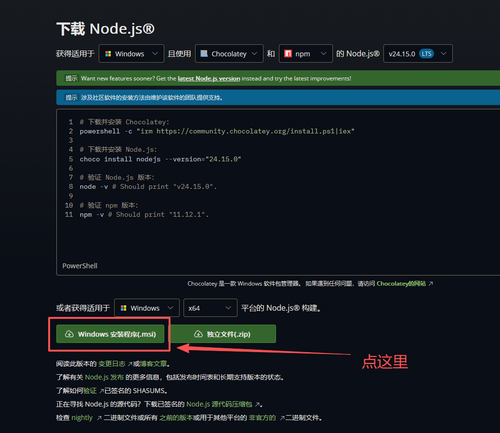
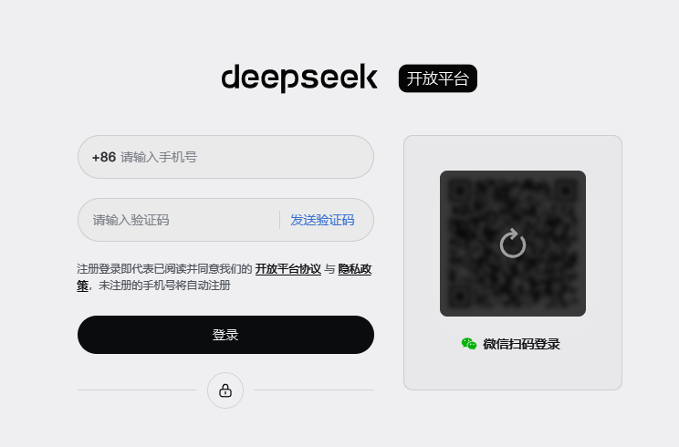
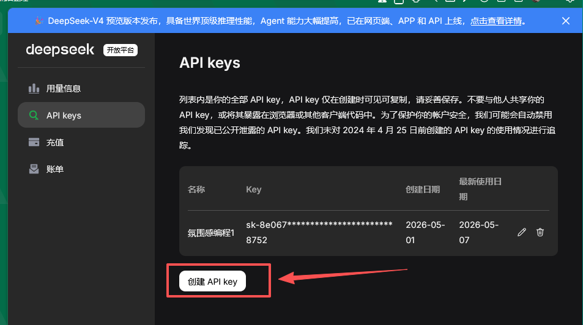
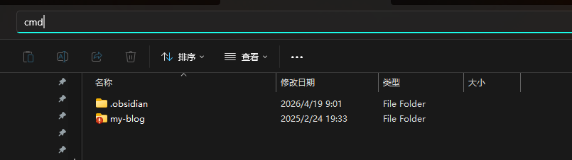
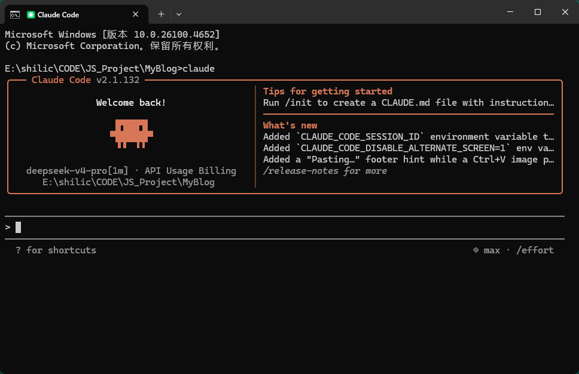
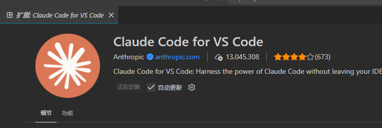
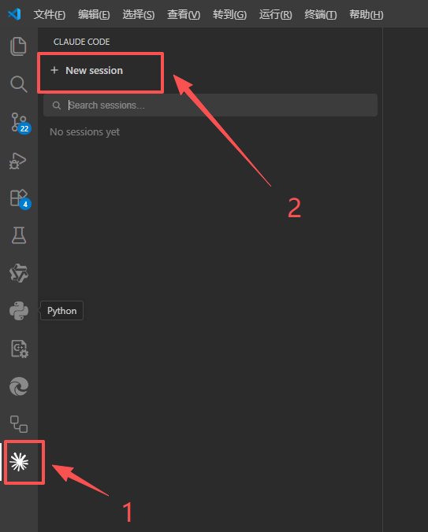
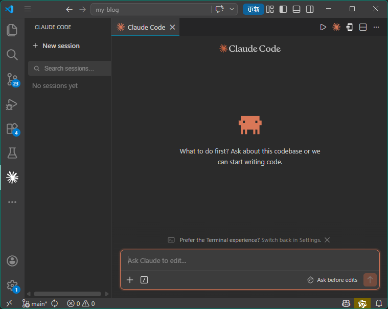
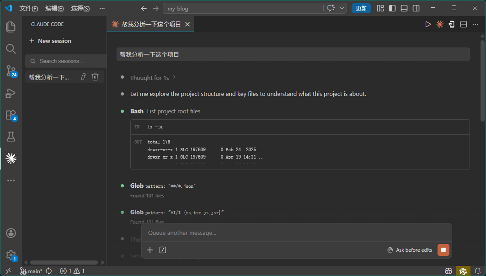

# 没有废话，一分钟教会你使用Claude Code [Claude Code入门]

没有废话，一分钟教会你使用Claude Code [Claude Code入门]

## 一、安装`nodejs`

如果你的电脑已经安装了`nodejs`，请跳过这一步。

访问`nodejs`官方网站：[https://nodejs.org/zh-cn/download](https://nodejs.org/zh-cn/download), 选择对应操作系统的安装包进行下载，windows推荐直接下载msi格式的安装包。





验证`nodejs`的安装，打开命令提示符，输入`node -v`然后回车，如果有版本号就是安装成功了。

```cmd
C:\Users\SLC>node -v
v22.14.0

C:\Users\SLC>
```

## 二、安装Claude Code

还是在刚才的`cmd`中，依次运行以下两个命令。

```cmd
npm config set registry https://registry.npmmirror.com 
npm install -g @anthropic-ai/claude-code
```


安装好了之后，再运行`claude -version`指令查看`claude-code`版本，如果如下边所示，提示了版本号，就是安装好了。

```cmd
C:\Users\SLC>npm config set registry https://registry.npmmirror.com

C:\Users\SLC>npm install -g @anthropic-ai/claude-code

added 2 packages in 10s

C:\Users\SLC>claude -version
2.1.132 (Claude Code)

C:\Users\SLC>
```

## 三、购买`Deepseek API`

这时先不要着急启动`Claude Code`，因为我们还没有配置API。我们访问 DeepSeek 开放平台：[https://platform.deepseek.com/](https://platform.deepseek.com/)。




登陆之后，我们先重置10块。然后手动创建一个API Key。如下图所示：




这个APIKey之后会消失，你先复制到其他地方。

## 四、配置Claude Code

我们有两个文件需要手动配置

### 配置`.claude.json`

该文件位于：`C:\Users\你的用户名`目录下，如果没有该文件，请启动一次 `Claude Code`,在命令提示符下运行`Claude Code`。

我们修改配置文件，添加一个配置`"hasCompletedOnboarding": true `

完整文件类似于下边,注意是英文逗号，上一个配置的结尾也需要添加英文逗号。该配置用于跳过用户登陆。

```json
{
  "firstStartTime": "2026-05-07T16:11:02.275Z",
  "opusProMigrationComplete": true,
  "sonnet1m45MigrationComplete": true,
  "seenNotifications": {},
  "migrationVersion": 13,
  "userID": "50f60b441a3d4900c88cccf69e5d68c79db1c568813881ae543f809ee84197e1",
  "changelogLastFetched": 1778170263061,
  "hasCompletedOnboarding": true 
}
```

### 配置 `settings.json`

该配置文件位于`C:\Users\你的用户名\.claude`目录下，如果没有该文件，请手动创建一个`settings.json`，注意，请确保后缀名必须是`.json`，可以在文件管理器中设置查看文件后缀名，防止后缀名被自动设置为`txt`。

 `settings.json`配置文件如下：

```json
{

  "env": {

    "ANTHROPIC_BASE_URL": "https://api.deepseek.com/anthropic",

    "ANTHROPIC_AUTH_TOKEN": "你的 API key",

    "ANTHROPIC_MODEL": "deepseek-v4-pro[1m]",

    "ANTHROPIC_DEFAULT_OPUS_MODEL": "deepseek-v4-pro[1m]",

    "ANTHROPIC_DEFAULT_SONNET_MODEL": "deepseek-v4-pro[1m]",

    "ANTHROPIC_DEFAULT_HAIKU_MODEL": "deepseek-v4-flash",

    "CLAUDE_CODE_SUBAGENT_MODEL": "deepseek-v4-flash",

    "CLAUDE_CODE_EFFORT_LEVEL": "max"

  },

  "theme": "dark"

}
```

填入刚才步骤3中你创建的API key。

这样，你的Claude Code就配置好了。

## 五、启动Claude Code

找一个目录作为Claude Code的工作目录，在文件管理器地址栏敲下`cmd`然后回车，系统会在当前目录打开命令提示符



敲下`claude`启动，出现以下画面，就是配置好了，可以愉快地开始使用了。




## 六、使用可视化界面来提升使用体验

光是命令行使用，退出后再进入，再看历史记录很麻烦，各种命令也非常难记。这时我们需要一个可视化界面来提升我们的使用体验。

这里我使用的是`Vs Code`的Claude Code插件，在`Vs Code`中搜索并安装该插件，如下图所示。



安装插件之后，你就可以使用可视化的界面来使用Claude Code了。刚才我们已经配置好了Claude Code，所以我们这里不需要其他的额外配置。如下图所示，我们直接点击左侧插件图标，再点击新会话按钮。






这个时候，写你的提示词即可，你可以让他给你做任何事情，帮你改代码，写PPT，或者直接上传文件给他让他分析excel表里的数据。




------

有更多Claude Code的进阶用法，例如如何添加并使用skill，我将在下一章节中讲解。


我是诚，感谢你的阅读，如果你觉得本文对你有帮助，请不妨动动你的手指点个关注和推荐。