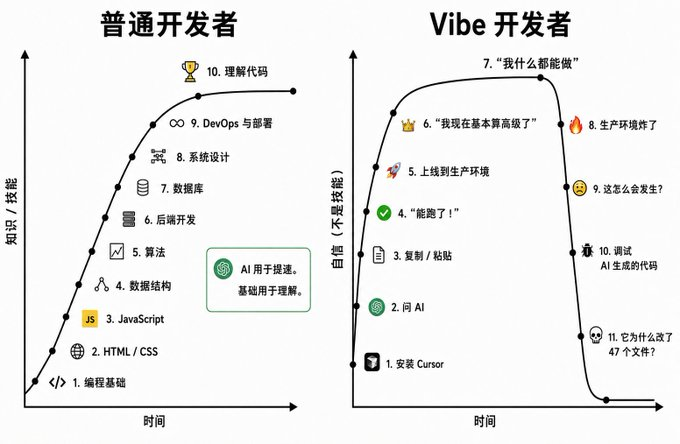

# 普通开发者 vs Vibe 开发者：真正的分界线，不是会不会写代码

AI 压低了把想法变成 Demo 的门槛，却没有取消验证、维护与责任。

一张“普通开发者 vs Vibe 开发者”的对比图，很容易让人会心一笑。

左边的人从编程基础一路学到数据库、系统设计和部署；右边的人安装 Cursor，问 AI，复制粘贴，“能跑了”就上线，然后在生产环境着火后问：“这怎么会发生？”



梗很准，但它把“学习曲线”，偷偷画成了“交付曲线”。

会从零写出系统，不等于每次都要从零手敲；会让 AI 生成代码，也不等于能够为系统负责。真正值得比较的，不是两种人，而是两种工作模式。

01 / DEFINE

## 先把词说准：用 AI，不等于 Vibe Coding

2025 年 2 月，Andrej Karpathy 用“Vibe Coding”描述一种近乎放弃代码控制权的玩法：不再阅读 diff，报错就原样丢回模型，直到程序“差不多能用”。他同时把适用范围说得很窄——一次性的周末项目。

这和“AI 辅助开发”并不是一回事。Simon Willison 给过一个实用边界：代码即使由模型生成，只要你审查、测试并能解释它，依然是在做软件开发。

普通开发模式

**先建立心智模型**，再写或生成代码。

Vibe 模式

**先追求可见结果**，把理解推迟到以后，甚至永久跳过。

AI 工程化模式

**让模型扩大产出**，让人保留解释、验证与决策权。

**判断：**Vibe Coding 不是“不会写代码的人用 AI”，而是“暂时不关心代码本身”的模式。高手也会 Vibe，只是更清楚什么时候该停。

来源：Karpathy 原始帖文，2025；Simon Willison，2025

02 / FIRST WIN

## Vibe Coding 的优势是真的：它把第一次成功提前了

传统学习路径把门槛放在结果之前。你要先理解变量、函数、框架、数据库和部署，才能让产品真正跑起来。

Vibe Coding 把顺序倒过来：先得到一个可点击、可演示、可分享的结果，再决定是否补课。它降低的不是软件工程的全部难度，而是**从零到第一次可见反馈**的成本。

55%

在 GitHub 的固定 JavaScript HTTP 服务实验中，使用 Copilot 的组平均完成得更快。


**事实：**AI 可以显著加快某些编码任务。**推论：**这种加速不能自动外推到需求澄清、架构权衡、上线风险和长期维护。

03 / CONTEXT

## “AI 到底更快还是更慢？”这个问题缺了条件

2025 年，METR 在 16 名经验丰富的开源开发者及其熟悉的大型仓库里做随机对照实验。246 个真实 issue 中，允许使用当时的 AI 工具，完成时间反而增加了 19%。参与者事前以为会快 24%，事后仍以为快了 20%。

但这也不是“AI 无效”的终局判决。METR 在 2026 年更新称，晚 2025 年工具的原始数据出现约 4%—18% 的提速信号；不过置信区间跨过零，而且样本选择偏差明显，因此不足以可靠估计当前提速幅度。

速度取决于任务分布

更容易提速

新项目 · 固定任务 · 重复代码 · 结果容易自动验证 · 出错可快速回滚

更容易被上下文拖慢

成熟仓库 · 隐含约束 · 跨模块修改 · 依赖业务历史 · 出错影响用户与数据

AI 的速度不是常数。它取决于任务是否容易描述、结果是否容易验证、错误是否容易恢复。


04 / COST SHIFT

## Vibe 没有消灭成本，只是把成本向后移动

生成速度越快，未被理解的代码也可能积累得越快。2025 Stack Overflow 开发者调查给出了四个值得并排看的信号：

```
72%表示 Vibe Coding 不是其专业流程的一部分
```

```
46%不信任 AI 输出准确性；信任者为 33%
```

```
66%最常遇到“几乎正确，但不完全正确”
```

```
45%认为调试 AI 生成代码更耗时
```


这些数字不能证明 AI 代码必然更差，却提示了一个结构性问题：**生成成本下降后，验证会成为新的瓶颈。**

DORA 2024 / 每增加 25% AI 采用率的相关变化

**交付吞吐量**　−1.5%

**交付稳定性**　−7.2%

这是统计相关，不是因果证明。DORA 推测更快生成可能扩大变更批次，使评审和发布更困难。

如果生成速度翻倍，测试、评审和发布机制没有同步升级，风险只会在更靠近用户的地方结算。

05 / UPGRADE

## 普通开发者真正会输的，不是手速，而是拒绝升级工作方式

坚持所有代码都必须亲手敲，可能把时间浪费在脚手架、样板代码、接口搬运和文档检索上；把“能运行”直接当成“可交付”，则只是把开发时间省成未来的排障时间。

更强的做法，是把工程能力从“写代码”上移到四个位置：

**01　描述约束**
不只告诉 AI 要什么，还说明不能破坏什么。

**02　切小变更**
一次解决一个可验证问题，避免一口吞下整套系统。

**03　建立证据**
测试、类型检查、静态分析、日志和可观测性跟上生成速度。

**04　保留解释权**
合并前说清数据流、失败路径、安全边界和回滚方案。

这不是回到“拒绝 AI”的旧世界，而是把 AI 放进软件工程，而不是让软件工程消失。

06 / RELEASE GATE

## 什么时候可以放心 Vibe，什么时候必须切回工程模式？

✓ 可以大胆 Vibe

一次性脚本、创意原型、个人小工具；没有真实用户数据、支付、权限和不可逆操作；错了能立刻删，失败成本清晰且很低。

! 必须切回工程模式

要上线给别人使用；涉及登录、权限、隐私、支付、计费、密钥、数据库迁移、外部 API；需要长期维护、团队协作、审计或故障追责。

唯一判断题

如果明天它出错，你能否解释发生了什么，并安全恢复？

如果答案是否定的，今天就还没有完成开发。

FINAL / OWN THE OUTCOME

## 真正的赢家，是会切换模式的人

原型阶段，Vibe 是创造力杠杆；进入生产，理解、测试和责任重新成为门票。

AI 可以替你生成代码，但不能替你拥有后果。

资料来源

1. Andrej Karpathy，关于 “vibe coding” 的原始 X 帖文，2025 年 2 月。
2. Simon Willison，Not all AI-assisted programming is vibe coding，2025。
3. Stack Overflow，2025 Developer Survey — AI。
4. GitHub，Research: quantifying GitHub Copilot’s impact，2022 / 2024 更新。
5. METR，开发者生产力实验与 2026 方法更新。
6. DORA，Accelerate State of DevOps Report 2024。