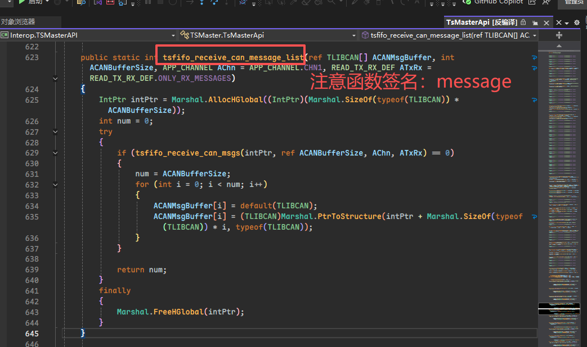
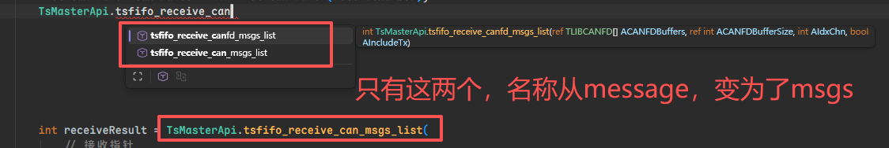
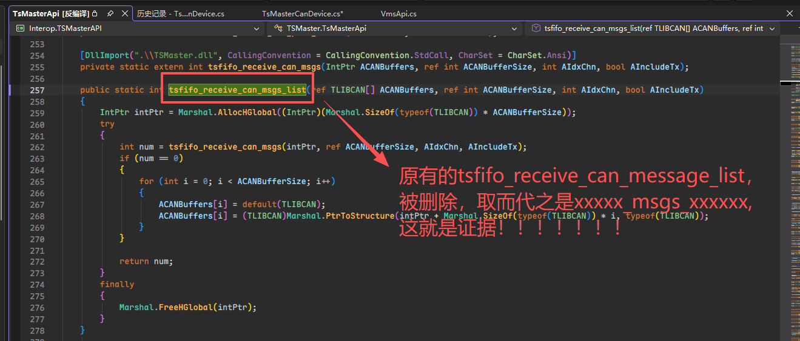
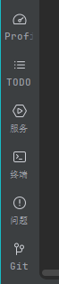
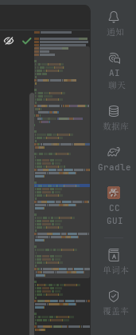
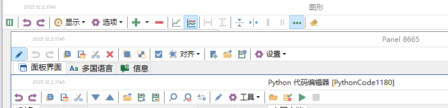
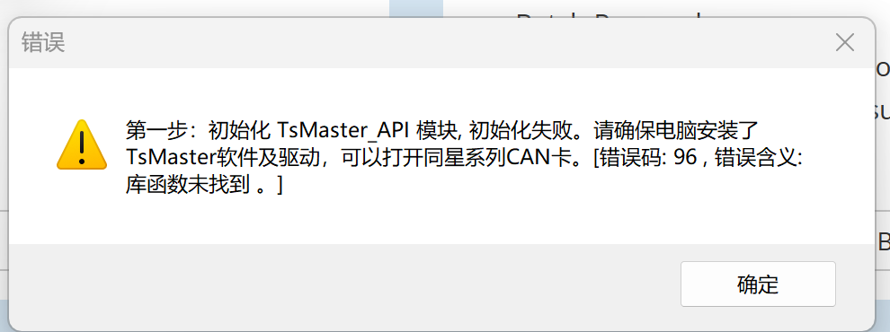
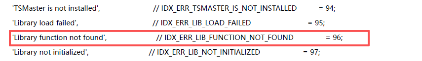

# SDK开发者的自我修养

> [!IMPORTANT]
>
> 随着软件项目的庞大，模块化开发成为必然，`高内聚低耦合`成为评价一个系统的重要标准。一个模块只做一件事，我们会把一些通用的代码分离出来，到其他项目中进行单独的维护，别人再通过依赖的方式使用。这就是SDK的作用。

**测试与质量保障**

- **单元测试覆盖率 ≥ 80%**，重点覆盖边界条件和异常路径。
- **集成测试**：模拟真实网络环境，测试端到端流程。
- **压力测试**：评估高并发下的性能和资源消耗。
- **持续集成（CI）**：每次提交自动运行测试、静态代码分析、构建检查。

## 一、 🔌 接口契约与向后兼容(最重要规范)

> [!NOTE]
>
> **一句话定义**：SDK 必须使用语义化版本号，并在同一主版本内严格遵守向后兼容承诺。

### 🌓 版本号即契约

> [!TIP]
>
> 所有对外暴露的接口（包括构造函数、方法签名、URL 路径、配置项）都必须在首次发布时确定版本号。

比如说针对 `Web API`，你可以用`/api/v2/users`方式定义`API`，这样不同版本可以共存，使用者可以逐步迁移，而不是被迫一次性全改。

#### ✍ 立刻上手: 使用`@since`文档注释

再比如说，我们的很多编程语言都有文档注释来标注函数或 API 的引入版本。以下是几个常见例子：

| 语言 / 工具                                  | 标签 / 写法                                 | 示例                                                         |
| -------------------------------------------- | ------------------------------------------- | ------------------------------------------------------------ |
| **`Java` (`JavaDoc`)**                       | `@since`                                    | `/** @since 1.8 */`                                          |
| **`Python` (`Sphinx` / `reStructuredText`)** | `.. versionadded::`                         | `.. versionadded:: 3.6`                                      |
| **`C#` (`XML `文档注释)**                    | `<since>`                                   | `/// <since>4.0</since>`（非标准，常用 `<remarks>` 或自定义标签） |
| **`TypeScript` / `JavaScript` (`JSDoc`)**    | `@since`                                    | `/** @since 2.0.0 */`                                        |
| **`Rust` (`rustdoc`)**                       | `#![doc(html_root_url = "...")]` + 文本说明 | 通常写在注释中，例如 `/// Available since Rust 1.30.0.`      |
| **`Go` (`godoc`)**                           | 无专用标签，直接在注释中写明                | `// Since Go 1.12, this function does ...`                   |

**核心思路**：无论哪种语言，都推荐在文档注释中使用明确的标签或自然语言注明“**此功能从哪个版本开始可用**”。这有助于使用者快速判断兼容性。

拿我最熟悉的`kotlin`代码来举一个例子

在 `Kotlin` 的文档注释（`KDoc`）中，推荐使用 `@since` 标签来标明函数从哪个版本开始支持。这是从 `JavaDoc` 继承而来的标准做法，`Kotlin` 官方也遵循这一惯例。

**示例:**

```kotlin
/**
 * 对字符串进行某种处理。
 *
 * @param input 待处理的字符串
 * @return 处理后的结果
 * @since xxx组件名称 1.2.0
 */
fun processString(input: String): String {
    // ...
}
```

如果你编写的是 `Kotlin` 标准库级别的代码，也可以使用 `@SinceKotlin` 注解（如 `@SinceKotlin("1.2")`），标注这个API从什么`kotlin`版本开始支持，但这属于注解而非文档注释。文档注释中仍建议使用 `@since` 标签。

### 🌔 版本号语义化

版本号本身要传达含义，通常指遵循 `SemVer`（语义化版本） 规范，格式为 `主版本.次版本.补丁`：

- **主版本**递增：做了不向后兼容的改动（比如删了一个方法、改了参数类型）。使用者需要修改代码才能升级。
- **次版本**递增：新增了功能或接口，但旧代码依然能用。使用者可以放心升级。
- **补丁**递增：只修了 `bug`，没改任何外部行为。升级无风险。

#### 📃 举个例子说明版本语义化

假设你开发了一个短信发送 SDK，最初发布版本 `1.0.0`，有一个方法 `sendSms(phone, text)`。

- 后来你想增加一个 `sendVoiceCode(phone)` 的新功能，但不影响旧的 `sendSms` → 版本号升为 `1.1.0`（次版本+1）。使用者无需改代码就能享受新功能。
- 再后来你发现 `sendSms` 的参数顺序不合理，想改成 `sendSms(text, phone)` → 这是不兼容改动，版本号升为 `2.0.0`（主版本+1）。使用者必须手动调整调用代码。
- 如果只是修复了某个国际号码的编码 bug，没有任何接口变化 → 版本号升为 `1.1.1`（补丁+1）。使用者可以无缝升级。

### 🌕 主版本内的铁律

> [!IMPORTANT]
>
> 在同一个主版本下，不得以任何方式破坏调用方的现有代码。

这意味着：

- 所有对外暴露的接口都必须在首次发布时确定版本号(如使用`@since`文档注释)
- 不能删除或重命名已公开的类、方法、常量。
- 不能修改已有方法的参数列表、返回值类型或抛出的异常类型。
- 新增字段或方法时，必须确保旧代码不受影响（例如使用默认值、可选参数、重载方法而非修改签名），不能导致旧代码编译失败或运行出错。
- 返回结果只增不减（例如 `JSON` 响应中新增字段不影响旧解析器，除非对方严格校验 `schema`）。
- 废弃的接口必须保留至少一个次版本周期，并用 `@Deprecated` 等标注明确提示。
- 每次发布(`release`或发布到软件包仓库)必须更新版本号，并在变更日志中写明变更。

### 👩‍🔬 为什么接口契约如此重要

因为 `SDK` 是被无数下游项目依赖的“积木”，随意修改会导致下游崩溃。如果没有版本化和语义化，使用者无法知道升级会不会炸掉自己的代码，最终要么不敢升级，要么出问题后骂你。有了这套规则，双方都能轻松管理依赖关系。

一旦打破向后兼容，就必须提升主版本号。这是对使用者的基本尊重——让他们能够根据版本号判断升级风险，决定何时迁移。

### 🙅‍♀️ 错误的做法

- 直接修改已有方法的参数类型而不升主版本；
- 将某个方法的返回值从 `String` 改为 `int`；
- 删除已公开的常量。删除了一个被大量引用的工具类。

### 👉 举一个反例： 同星`TSMaster API`的兼容性问题

先来看一个，`2023`年的同星`TSMaster API`，是如何接收一组报文的，真实源代码如下，此时的函数签名还是`tsfifo_receive_can_message_list`



我们再来看一下，2025年的同星`TSMaster API`是如何接收一组报文的。

> [!CAUTION]
>
> 截图为证，同星的工程师们，你们别抵赖哈！！





原来的`tsfifo_receive_can_message_list`函数直接被删除了，替换成了`tsfifo_receive_can_msgs_list`，并且函数的参数的类型也乱改了。

可能同星`TSMaster API`的工程师觉得，我既然是读取 **一组** 报文，那名称命名为 `msgs`应该很合理吧。你是觉得很合理了，那你有考虑过用户的感受吗，2023年还是`message`，到了2025年直接变成`msgs`，原来的上位机程序直接无法运行了。

这就是其前边一直说的：`接口就是契约`，这件事非常重要，我承诺一旦我的SDK发布，我的函数签名将不会有任何改动。好在不是把SDK发布到`nuget`，要不然将会被骂惨。关于如何将软件包发布到公共仓库，可以看我之前的博客。

#### 正确的做法

那同星工程师正确的做法是什么？

- 绝不修改函数签名，即便已经不再维护了，也要继续给用户提供，这是对使用者的基本尊重。
- 凡是公开的接口契约，注明发布的起始日期。
- 升级时，保留原有的函数签名，同时提供旧版和新版，给旧版打上弃用标记，引导用户使用新版。

示例代码如下：

```C#
/// <summary> 从缓冲队列中读取一组报文 </summary> 
/// <since>2025.12.13</since>
public static int tsfifo_receive_can_msgs_list(ref TLIBCAN[] ACANBuffers, ref int ACANBufferSize, int AIdxChn, bool AIncludeTx) {
    IntPtr intPtr = Marshal.AllocHGlobal((IntPtr)(Marshal.SizeOf(typeof(TLIBCAN)) * ACANBufferSize));
    try {
        int num = tsfifo_receive_can_msgs(intPtr, ref ACANBufferSize, AIdxChn, AIncludeTx);
        if (num == 0) {
            for (int i = 0; i < ACANBufferSize; i++) {
                ACANBuffers[i] = default(TLIBCAN);
                ACANBuffers[i] = (TLIBCAN)Marshal.PtrToStructure(intPtr + Marshal.SizeOf(typeof(TLIBCAN)) * i, typeof(TLIBCAN));
            }
        }
        return num;
    }
    finally {
        Marshal.FreeHGlobal(intPtr);
    }
}
/// <summary> 从缓冲队列中读取一组报文 </summary> 
/// <since>2023.6.14.901</since>
[Obsolete("该接口已废弃，请使用 tsfifo_receive_can_msgs_list 替代")]
public static int tsfifo_receive_can_message_list(ref TLIBCAN[] ACANMsgBuffer, int ACANBufferSize, APP_CHANNEL AChn = APP_CHANNEL.CHN1, READ_TX_RX_DEF ATxRx = READ_TX_RX_DEF.ONLY_RX_MESSAGES){
    /* 省略 */
}
```

------


## 二、 🚪 最小惊奇原则：设计层抹除心智负担

> [!NOTE]
>
> **一句话定义**：一个好的设计，从设计层面就把使用者的心智负担抹掉了——用户不需要猜、不需要试错、不需要读文档，看到的那一刻动作已经定了。

这句话源于唐纳德·诺曼的《设计心理学》：**好的设计让东西自己会说话，坏的设计逼用户读说明书。**

### 惊奇感公式

> 💡 **惊奇感的来源 = 实际行为 − 用户预期**

- 差值为 0 (刚好达到用户预期) → 零心智负担（**理想态**）
- 差值为正 (超出用户预期) → 意外之喜（但更多时候是"咦？怎么会这样"的困惑）
- 差值为负 (没有达到用户预期) → 踩坑、报错、反直觉（**最糟糕**）

优秀的设计师做的不是"创造惊喜"，而是**把这个差值压缩到趋近于零**——让用户的所有预测都命中，所有动作都有预期内的结果。这就是"好的设计是透明的"：你感受不到它，因为你从来不需要去思考它。

### 现实世界中的最小惊奇

最小惊奇原则，不单单是软件开发独有的设计原则，而是现实世界的工程应用都应该遵循的原则。

#### 🚪 一扇门的设计哲学

**反面**：玻璃门装了把手，你伸手一拉，发现是"推"的，撞玻璃上。再看对面贴了个"推"，但你进门那一刻**还是得先用身体试错**。这就是心智负担——你要先解读"这个把手是装饰还是真的能拉"。

**正面**：诺曼的设计——"推"的门做成**平板**，"拉"的门装**明显能握的把手**。你看到那瞬间动作已经定了，**根本不需要贴"推/拉"两个字**。标签本身就是设计失败的补丁——当你需要写说明告诉用户怎么用，说明产品本身没说清楚。

或者直接做成双向可推拉的门——彻底消灭正确或错误的使用方式。

#### 🚗 汽车工业的三个例子

**单踏板模式**：传统车有两个踏板——油门加速、刹车减速。这是物理世界几十年的肌肉记忆。单踏板模式把"松油门=刹车"做成默认行为，在紧急情况下驾驶员的本能是"猛踩刹车"，但肌肉记忆可能让他们误踩油门。**设计违背了全人类几十年的驾驶直觉。** 工信部直接叫停——这不是技术不行，是惊奇感差值太大。

**隐藏式门把手**：正常门把手是凸起的，你一拉就开，三岁小孩都知道怎么用。隐藏式门把手呢？每个品牌的弹出方式都不一样——有的按一下弹出来，有的要按特定位置、特定力度。站在一辆不熟悉的车门前，你连"怎么把把手弄出来"都不知道。**一个本该零思考的动作，变成了需要研究和试错的操作。** 

**雨量传感器 + 自动雨刮**：传统车下雨时要经历"找拨杆 → 判断雨量 → 选档位 → 雨变大再调 → 雨变小再调"——你一直在手动维护雨刮状态。雨量传感器把这个循环全砍了：感应雨量 → 自动调速，从毛毛细雨到倾盆大雨，你只管看路。**消除的不是操作难度，而是操作本身。**

#### 🔌 USB-C vs Lightning vs Micro-USB

**反面**：Micro-USB 有方向性，插反了怼不进去。Lightning 解决了正反盲插，但你得是 Apple 生态。两种线不能通用。

**正面**：USB-C 正反都能插，而且是跨品牌、跨设备的统一标准。**插的动作本身零思考——你不需要先看方向、不需要辨认"这头朝上还是朝下"。** 物理层的最小惊奇。

#### 🎨 图标设计：看得懂 vs 猜不透

- **`VS Code`**：图标风格统一，含义清晰——文件夹是文件夹，搜索是搜索，Git 分支是 Git 分支。看一眼就知道点哪里。


- **`JetBrains IDEA`**：图标同样清晰，且支持**附带文本标签**——图标 + 文字双重确认，消除歧义。





- **反面教材 —— `TSMaster`**：部分图标设计模凌两可，用户看到后不知道点下去会发生什么，只能一个一个试。下面是截图对比：

  

  

> 如果图标表意不清晰，建议都加上文字说明。

### 软件 API 中的最小惊奇

上面都是物理世界的例子。回到 `SDK` 设计，最小惊奇原则落地为几条硬规范：

#### 1. 命名遵循行业惯例

**规范**：

- 方法命名必须符合平台和行业通用的动词约定。使用者不需要查文档就能推断一个方法的行为。
- 副作用应当最小化(避免隐式魔法行为)，函数名称是什么就做什么；有副作用的方法必须用动词明确标注。任何"自动帮你做的事"都需要在文档或方法名中明确声明。

| 前缀或后缀 | 预期行为 | 示例 |
|---|---|---|
| `get` | 返回只读对象，不修改状态 | `getUser(id)` |
| `getOrCreate`               | 读取不到则创建一条记录(副作用可预测)                   | `getOrCreateUser(id)` |
| `fetch` | 单纯获取，不会重试 | ` fetch(url: String)` |
| `WithRetry` | 执行失败会重试(副作用可预测) | `fetchWithRetry(url: String, maxRetries: Int = 3)` |
| `find` | 查询，可能返回空 | `findUsers(filter)` |
| `create` / `build` | 新建资源 | `createClient(config)` |
| `delete` / `remove`/`close` | 删除资源(**应当是幂等的，反复执行关闭操作不应当报错**) | `deleteFile(path)` |
| `update` / `set` | 修改已有资源 | `updateProfile(user)` |
| `is` / `has` / `can` | 返回布尔值 | `isConnected()`、`hasPermission()` |

**反例**：

- `getUser`应该是只读，不会产生副作用；却在内部偷偷创建了一个新用户并写入数据库；
- `processData` 应该只处理数据，既不返回数据也不修改数据；但是却发了封邮件——没人能从名字猜出它干了什么。

#### 2. 参数顺序符合常识

**规范**：参数排列应遵循"先主要后次要、先输入后输出、先目标后内容"的自然语序。

```java
// ✅ Java 标准库：source 在前，destination 在后——几十年没变过
System.arraycopy(src, srcPos, dest, destPos, length);

// ❌ 反直觉：把 dest 放在 src 前面——每次调用都要停顿想一下
System.arraycopy(dest, destPos, src, srcPos, length);
```

从源数组到目标数组，非常符合使用直觉。

#### 3. 返回值一致且可预测

**规范**：同一个模块中，相似场景的返回值类型必须一致。查询"找不到"时统一返回空值，不混用 `null` 和空集合。

```kotlin
// ✅ 一致：找不到时都返回空列表
fun findUsersByAge(age: Int): List<User>   // 可能返回 emptyList()
fun findUsersByTag(tag: String): List<User> // 同样返回空列表

// ❌ 不一致：一个返回 null，一个返回空列表，一个抛异常
fun findUsersByAge(age: Int): List<User>?   // 可能返回 null
fun findUsersByTag(tag: String): List<User>  // 返回空列表
fun findUsersByCity(city: String): List<User> // 找不到就抛 NoSuchElementException
```

调用方要写三套不同的判空逻辑。这就是心智负担——不是在用你的 API，是在**防御你的 API**。

#### 4. 副作用可感知：命名不说谎

**规范**：函数签名必须诚实——参数是否会被修改、返回值是否可能为空、有没有副作用，全部要在签名、前缀或名称中明示。**调用方不应该在读函数体之后才发现某些参数被改了、某些行为悄悄发生了。** 签名就是 `API `的契约，契约不说谎。

拿一个真实案例来讲——汽车电子行业里，UDS 诊断协议的 0x27 服务（`SecurityAccess`）要求 `ECU` 供应商提供一个 `DLL`，整车厂调用它来解锁 ECU。国内两大供应商——周立功（ZLG）和 Vector——各自给出了模板。同一个功能，签名天差地别。

```c
// ❌ 周立功版：返回 int（魔法返回值, 不清楚返回值含义），前缀全标 i（说谎），没有缓冲区容量（隐式越界风险）
extern "C" int ZLGKey(
    const unsigned char* iSeedArray,        
    unsigned short iSeedArraySize,          
    unsigned int iSecurityLevel,            
    const char* iVariant,                    
    unsigned char* iKeyArray,              // 标了 i，但实际上是输出缓冲区 (有副作用，但没有说明)
    unsigned short* iKeyArraySize          // 标了 i，但函数会修改它的值 (有副作用，但没有说明)
);
```

而 Vector 的同一功能，签名里把一切都说明白了：

```c
// ✅ Vector 版：枚举返回值(避免了魔法返回值) + i/io/o 三分前缀 + const 修饰 + 缓冲区容量
/* Vector 安全算法 GenerateKeyEx 的返回值 */
enum VKeyGenResultEx {
	/* 完成 */
	KGRE_Ok = 0,
	/* 缓冲区太小 */
	KGRE_BufferToSmall = 1,
	/* 安全等级无效 */
	KGRE_SecurityLevelInvalid = 2,
	/* 变体参数无效 */
	KGRE_VariantInvalid = 3,
	/* 未指定错误 */
	KGRE_UnspecifiedError = 4
};

KEYGENALGO_API VKeyGenResultEx GenerateKeyEx(
    const unsigned char*  ipSeedArray,           // i  → 纯输入
    unsigned int          iSeedArraySize,        // i
    const unsigned int    iSecurityLevel,        // i
    const char*           ipVariant,             // i
    unsigned char*        iopKeyArray,           // io → 既是输入，也是输出；会被填充
    unsigned int          iMaxKeyArraySize,      // i  → 缓冲区容量，纯输入
    unsigned int&         oActualKeyArraySize    // o  → 纯输出
);
```

**同样的功能，同一个行业。好的签名跟你诚实交代每一个参数的角色，烂的签名让你猜。** 和第四章呼应——`KGRE_BufferToSmall` 不只是"出错了"，它在告诉调用方**接下来该做什么**（缓冲区太小），而周立功的 `-1` 什么都没说。

### 最小惊奇在 SDK 设计中的精炼

> 💡 使用者拿起你的 SDK，三分钟能跑通第一个 Demo，十分钟能写出第一个可用功能——不是因为他聪明，是因为你的设计没给他设置障碍。


## 三、🥊 最小依赖原则：零冗余，不绑架

> [!NOTE]
>
> **一句话定义**：`SDK` 运行时只依赖绝对必要的底层库，且优先选择标准库或业界广泛使用的轻量库；所有可选功能做成可选，由调用方自行决定是否引入。

### 为什么依赖要最小化

你引入一个第三方库，表面上只是加了一行 `implementation`。实际上你替所有使用者做了以下决定：

- **版本冲突**：使用者的项目里已经有 `okhttp 4.9`，你的 SDK 硬编码依赖 `okhttp 4.12`——构建工具会自动把 `4.9` 静默升级成 `4.12`。这会存在潜在冲突。
- **包体积膨胀**：一个几百 `KB` 的 `SDK` 因为传递依赖变成几 `MB`，对于移动端或边缘设备来说是灾难。
- **安全漏洞传播**：每多一个依赖就多一个潜在的攻击面。如果某个传递依赖爆出高危漏洞，你的 SDK 也会被牵连。
- **许可证污染**：你引入了一个 `GPL` 协议的库，使用者的商业项目被迫开源。

**每引入一个依赖，你都是在替使用者做决定——而他们没有否决权。**

### 怎么做

**硬性标准**：

- 运行时依赖只能包含底层设施：`JSON` 解析、`HTTP` 客户端、加密库、`Excel`解析库——这些你不可能自己写的底层设施
- 优先选择标准库。能用 `java.net.http` 就不用 `OkHttp`，能用 `kotlinx.serialization` 就不引入 `Gson`
- 每次新增依赖前问自己："我能不能用 20 行代码代替这个库？"如果能，自己写
- 定期审查依赖树，看哪些依赖实际上只用了其中一两个方法

### 反面例子1：滥用工具库

```kotlin
// ❌ 一个小工具 SDK，依赖却比业务项目还重
dependencies {
    implementation("com.google.guava:guava:32.0.0-jre")      // 只用了 Preconditions.checkNotNull
    implementation("org.apache.commons:commons-lang3:3.12.0") // 只用了 StringUtils.isBlank
    implementation("com.google.code.gson:gson:2.10.0")       // 只做了一处 JSON 序列化
}
```

三个库加起来几 MB，SDK 自己的代码才几百行。这不是"为了省事"，这是"把使用者的项目当垃圾桶"。

```kotlin
// ✅ 同一个 SDK，遵循最小依赖
dependencies {
    implementation(kotlin("stdlib"))                     // 标准库，无争议
    // Guava? 自己写 checkNotNull —— 3行代码
    // commons-lang3? 自己写 isBlank —— 1行代码
    // Gson? 用 kotlinx.serialization 
}
```

> 💡 **一句话**：你的 SDK 是使用者项目的客人，不是主人。客人不带一车行李进主人家门。

### 反面例子2：同星`TSMaster API`

哈哈哈，我又来给同星`TSMaster API`鞭尸了，感觉像是为了这一叠醋，包了这一盘饺子是吧(写这篇博客)。是的，这篇博客的一大目的通过同星`TSMaster API`的反面例子来讲SDK的设计规范。

下图是我上位机的真实报错，为什么发生这个问题呢，因为我最新的UDS诊断上位机一部分功能是基于同星`TSMaster API`2025版开发的，而用户的电脑上安装的是2023年甚至更早版本的同星`TSMaster API`，






## 四、 ❌ 错误即信息：统一异常/错误码体系

> [!NOTE]
>
> **核心思想**：所有可预见的错误都要有结构化的表达，帮助调用方快速定位和处理。
>
> - 定义基础异常类和分类子异常（如 `AuthException`、`NetworkException`、`ValidationException`）
> - 错误码采用三段式：`[服务前缀]-[错误级别]-[序号]`，附带人类可读消息和排查指引
> - 严禁直接抛出裸 `RuntimeException` 或返回无意义的数字码

### 为什么错误处理需要体系化

看一段调用方被迫写的代码：

```kotlin
// ❌ 调用方被迫用字符串匹配异常消息
try {
    sdk.uploadFile(file)
} catch (e: Exception) {
    when {
        e.message?.contains(“timeout”) == true -> retry()
        e.message?.contains(“auth”) == true -> refreshToken()
        e.message?.contains(“disk full”) == true -> cleanUp()
        else -> throw e
    }
}
```

用**字符串匹配异常消息**来决定后续行为——这是把”接口契约”退化成了”猜谜游戏”。一旦你更新 SDK 改了错误消息的文字，这段代码就静默失效。

### 怎么做

**定义异常层级**：

```kotlin
// ✅ 结构化的异常体系
open class SdkException(message: String, cause: Throwable? = null) 
    : RuntimeException(message, cause)

class AuthException(message: String) : SdkException(message)       // 认证失败 → 刷新 Token
class NetworkException(message: String) : SdkException(message)    // 网络超时 → 重试
class ValidationException(message: String) : SdkException(message) // 参数非法 → 修正参数
class ServerException(val statusCode: Int, message: String) : SdkException(message) // 服务端错误
```

**调用方的代码从猜谜变成了类型匹配**：

```kotlin
// ✅ 调用方可以程序化地处理不同错误
try {
    sdk.uploadFile(file)
} catch (e: AuthException) {
    refreshToken()
} catch (e: NetworkException) {
    retry()
} catch (e: ValidationException) {
    log.error(“参数错误: ${e.message}”)
    throw e  // 参数错误不需要重试
}
```

### 反面例子

这就是为什么第二章里 `Vector` 的 `GenerateKeyEx` 返回的是 `VKeyGenResultEx` 枚举而不是 `int`：

```c
// ❌ 周立功：返回 int，-1 和 0 说不清任何事
// 调用方拿到了 `-1`，然后呢？重试？还是参数有问题？一个 -1 告诉不了任何人任何事。
extern “C” int ZLGKey(...);

// ✅ Vector：返回枚举，每个值都是一条可操作的指令
enum VKeyGenResultEx {
    KGRE_Ok = 0,                  // 调用方：继续
    KGRE_BufferToSmall = 1,       // 调用方：调大缓冲区再试
    KGRE_SecurityLevelInvalid = 2,// 调用方：检查安全等级参数
    KGRE_VariantInvalid = 3,      // 调用方：检查变体参数
    KGRE_UnspecifiedError = 4     // 调用方：联系管理员
};
```

`KGRE_BufferToSmall` 不只是”出错了”，它在告诉调用方**接下来该做什么**——把缓冲区调大再调一次。而 `-1` 什么也没说。

> 💡 **错误处理的本质不是”告诉用户出错了”，而是”告诉用户接下来该怎么办”。**

## 五、 📋 日志可插拔：绝不强制绑定日志框架

> [!NOTE]
>
> **一句话定义**：`SDK` 通过日志门面输出，让使用者用自己的日志框架接管。不要在 `SDK` 里写死 `println` 或绑定特定日志实现。

### 为什么日志不能写死

使用者的项目用的是 `SLF4J` + `Logback`，你的 `SDK` 直接 `System.out.println`。结果：`SDK` 日志出现在控制台而非日志文件，运维看不到；无法按级别过滤；格式和项目统一格式不一致，`ELK` 解析不了。

**你写了 `println`，等于替他决定了"这个信息不重要，丢控制台就行"。**

### 怎么做

```kotlin
// 在你的 SDK 中（面向 SLF4J 编程） ✅ 使用 SLF4J 门面
import org.slf4j.LoggerFactory

class SdkClient(private val config: SdkConfig) {
    private val logger = LoggerFactory.getLogger(SdkClient::class.java)

    fun sendRequest(data: ByteArray) {
        logger.debug("发送请求: {} bytes", data.size)
        // ...
        logger.info("请求完成: {} ms", elapsed)
    }
}
```

使用者自己决定日志去哪、什么级别、什么格式。SDK 的日志和他项目的日志融为一体。同时提供关闭日志的选项（如 `logLevel = OFF`）。

### 反面例子

```kotlin
// ❌ 直接 println——控制台污染，无法统一管理
fun fetchData(): Data {
    println("开始请求...")            // 格式无法统一
    val result = httpClient.get()
    println("请求完成: $result")      // 级别无法控制
    return result
}

// ❌ 硬编码依赖 Logback
import ch.qos.logback.classic.Logger  // 直接依赖实现，而非门面
```

> 💡 **SDK 是客人，客人不应该擅自决定客厅的装修风格。**

## 六、 🧪 测试与质量保障

> [!NOTE]
>
> **一句话定义**：没有测试的 SDK 不是给使用者用的，是用来折磨使用者的。最低标准：单元测试覆盖率 ≥ 80%，CI 自动化。

### 为什么测试在 SDK 开发中是铁律

SDK 和普通业务代码不一样——你的一个 bug，会出现在所有使用者的项目中。业务代码的 bug 只影响一个功能，SDK 的 bug 影响一整个生态。

### 三层测试体系

```kotlin
// 1. 单元测试：覆盖率 ≥ 80%，重点覆盖边界条件
@Test
fun `解析空 byte 数组应返回空列表而非 null`() {
    val result = decoder.decode(byteArrayOf())
    assertEquals(emptyList<Signal>(), result)  // 空输入 → 空列表，不是 null
}

@Test
fun `因子为 0 时应抛出明确异常`() {
    val ex = assertThrows<ValidationException> {
        Signal(factor = 0.0, offset = 1.0)
    }
    assertTrue(ex.message!!.contains(“factor”))
}
```

```kotlin
// 2. 集成测试：SDK 内置 Mock Server
class MockServer(private val port: Int) {
    fun expectResponse(path: String, body: String, status: Int = 200) { /* ... */ }
    fun start() { /* ... */ }
    fun stop() { /* ... */ }
}

@Test
fun `使用内置 MockServer 测试完整请求链路`() {
    val mock = MockServer(8080).apply {
        expectResponse(“/api/v1/user”, “””{“name”:”张三”}”””)
        start()
    }
    val sdk = SdkClient(SdkConfig.Builder().baseUrl(“http://localhost:8080”).build())
    assertEquals(“张三”, sdk.getUser().name)
    mock.stop()
}
```

```yaml
# 3. CI 自动化：每次提交触发
# .github/workflows/test.yml
# - 单元测试
# - 静态代码扫描（detekt / ktlint）
# - 构建检查
# - 兼容性检查（用上一个版本的调用方代码跑一遍当前 SDK）
```

### 反面例子

- 给别人用的网络 SDK，没有任何 Mock 工具，要求使用者自己 mock 整个 HTTP 层
- 测了正常路径，没有测”传 null 会怎样””网络断了会怎样””并发调用会怎样”
- 依赖”本地能跑”来判断质量，没有 CI

> 💡 **你能想到的边界条件不去测试，使用者在生产环境就会替你测。**

## 七、 📖 良好的文档和示例

> [!NOTE]
>
> **一句话定义**：使用者的第一行代码是在 README 里复制的，不是自己写的。文档就是 SDK 的产品界面。

### 文档的最低构成

```
📁 sdk-project/
├── README.md          ← 安装步骤 + 30 秒快速开始
├── examples/           ← 完整可运行的示例代码，每次发布前必须编译通过
├── docs/
│   ├── api-reference/  ← 每个接口的参数、返回值、异常说明
│   └── migration/      ← 版本升级时的变更说明
└── CHANGELOG.md        ← 每个版本的改动记录
```

### 快速开始：30 秒原则

README 的开头必须有一段”复制 → 粘贴 → 运行”就能看到效果的最小代码：

```kotlin
// ✅ 30 秒能跑起来的最简示例
// 1. 添加依赖
implementation(“io.github.shilic:smart-dbc:1.0.11”)

// 2. 三行代码看到结果
val dbc = Dbc.read(File(“example.dbc”))
val speedSignals = dbc.messages.flatMap { it.signals }.filter { it.name.contains(“speed”) }
println(“找到 ${speedSignals.size} 个速度相关信号”)
```

### `FAQ` 和排错指南

`README` 里至少回答：依赖冲突了怎么办？超时时间怎么调？怎么在 `Android` 上使用？错误码在哪查？**每一个你回答过的 `GitHub Issue`，都应该成为 FAQ 里的一条。**

### 反面例子

- 只有一个空 `README`，写”请参考源码”
- `README` 上的示例是 1.0 的 API，实际已经 2.0——复制的第一行就编译不过
- `examples/` 目录里的代码从来没编译过

> 💡 **好的文档不教用户怎么”用”你的 SDK——而是帮他解决”用你的 SDK 时遇到的问题”。**

## 八、 🔄 持续交付与发布流程

> [!NOTE]
>
> **一句话定义**：发布不是最后一刻的事，是从第一行代码就开始的自动化流水线。

### 发布前的门禁

每次合并到主分支前，CI 必须跑过全部检查：

| 门禁 | 说明 |
|---|---|
| **单元测试 ≥ 80%** | 低于 80% 直接拒绝合并 |
| **静态代码扫描** | 依赖冲突检查、安全漏洞扫描、代码风格检查 |
| **兼容性测试** | 用上一个版本的调用方代码跑一遍当前 SDK——跑不通说明有不兼容改动 |
| **示例代码编译** | `examples/` 下的所有代码必须能编译并运行通过 |

### 版本号和 CHANGELOG

版本号在 CI 流水线中根据 commit 类型自动生成：`fix:` → 补丁+1，`feat:` → 次版本+1，`BREAKING CHANGE:` → 主版本+1。CHANGELOG 从 commit message 自动生成，**不允许”发布完了再补”。**

### 反面例子

- 手动发布，忘了改版本号，线上存在两个版本号一样的 jar
- 没有兼容性测试，靠”感觉”判断是否兼容——你的感觉在几百个使用者的生产环境面前一文不值
- 发布后才发现 `examples/` 里的代码已经跑不通了

> 💡 **发布的本质不是”让包出现在仓库里”，而是”让使用者拿到一个经过验证、拿过去就能用的制品”。**