# 用`Gitea`搭建私有`Git`代码托管平台

在现代软件开发中，`Git `已经成为最流行的[版本控制系统](https://developer.cloud.tencent.com/techpedia/1907?from_column=20065&from=20065)之一。虽然 `GitHub`、`Gitee`、`GitLab `等公共服务提供了方便的托管平台，但有时候由于安全性、隐私或其他定制化需求，我们需要搭建一个自己的 `Git `服务器。团队共享代码、协同开发，数据完全在自己手里。

## 一、认识 [`Gitea`](https://about.gitea.cn/)

> `Gitea `是一个轻量级的 `DevOps `平台软件。从开发计划到产品成型的整个软件生命周期，他都能够高效而轻松的帮助团队和开发者。包括 `Git  `托管、代码审查、团队协作、软件包注册和 `CI/CD`。它与 `GitHub`、`Bitbucket` 和 `GitLab `等比较类似。 `Gitea `最初是从 [`Gogs`](http://gogs.io) 分支而来，几乎所有代码都已更改。
>
> `Gitea`的首要目标是创建一个极易安装，运行非常快速，安装和使用体验良好 的自建 `Git `服务。
>
> 采用`Go`作为后端语言，只需生成一个可执行程序即可。 支持 `Linux`, `macOS `和 `Windows`等多平台， 支持主流的`x86`，`amd64`、 `ARM `和 `PowerPC`等架构。

官网: [https://about.gitea.cn/](https://about.gitea.cn/)

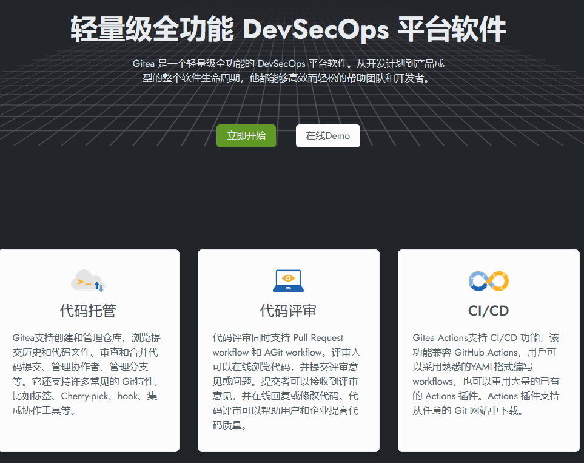

1. **内网私有化部署**：能够在内网部署 `Gitea `使其可以更好地控制数据流向和安全性。
2. **开源优势**：`Gitea `的开源特性是其重要的特性之一。**它基于 `MIT `许可证，意味着可以自由使用、修改和分发软件，完全不受限制**。
3. **成本效益**：`Gitea` 的免费开源模式 `Gitea `对硬件资源的要求较低，能够在低成本的服务器或 VPS 上轻松运行。其轻量化的特性使得运维成本大幅减少，可以灵活地选择基础设施来部署。
4. **多**[**用户权限管理**](https://developer.cloud.tencent.com/techpedia/2364?from_column=20065&from=20065)：`Gitea `提供了细粒度的权限控制，适合企业对不同团队、项目的管理需求。**管理员可以为不同的用户或团队分配特定权限，确保代码安全**。

和其他方案相比：

| | `Gitea` | `GitLab` | `Gogs` |
|------|-------|--------|------|
| 语言 | `Go` | `Ruby/Rails` | `Go` |
| 资源占用 | 极低（~100MB 内存） | 高（建议 4GB+） | 极低 |
| 安装 | 单个 exe，免安装 | 依赖一大堆 | 单个 exe |
| `CI/CD` | 需配合 `Actions` | 内置 `GitLab CI` | 无 |
| 社区活跃度 | 高（从 `Gogs `分叉后独立发展） | 最高 | 停滞 |
| 适用场景 | 个人/小团队私有部署 | 企业全流程 | 已经不再维护 |

如果你不需要 `GitLab` 那一套重量级 `CI/CD`，`Gitea` 是最佳选择：轻、快、不挑硬件。

## 二、安装前的准备

### 必备依赖：Git

#### 下载Git

`Gitea` 底层依赖 `Git `命令行工具。先去 [gitforwindows.org](https://gitforwindows.org/) 下载安装 `Git for Windows`。

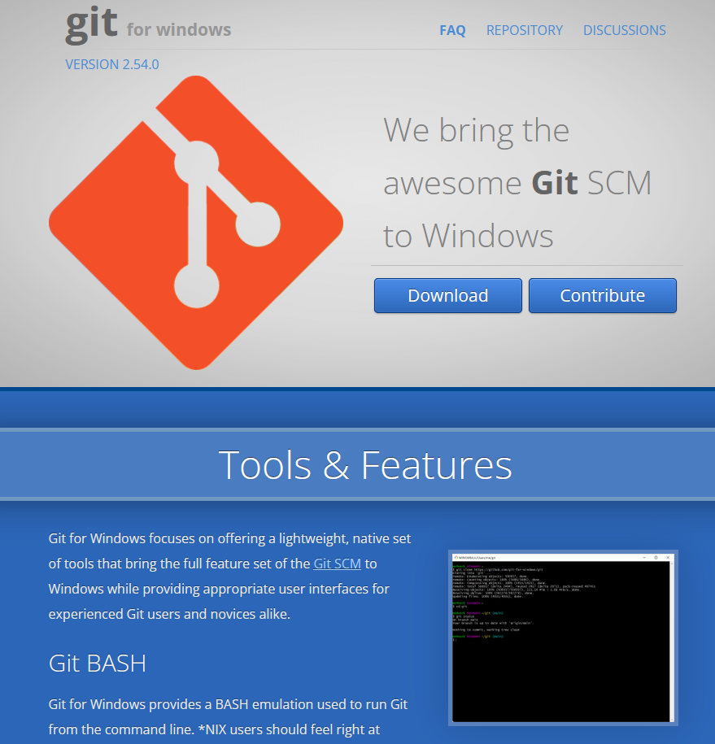

#### 安装Git

运行下载的安装程序，按照默认选项安装。

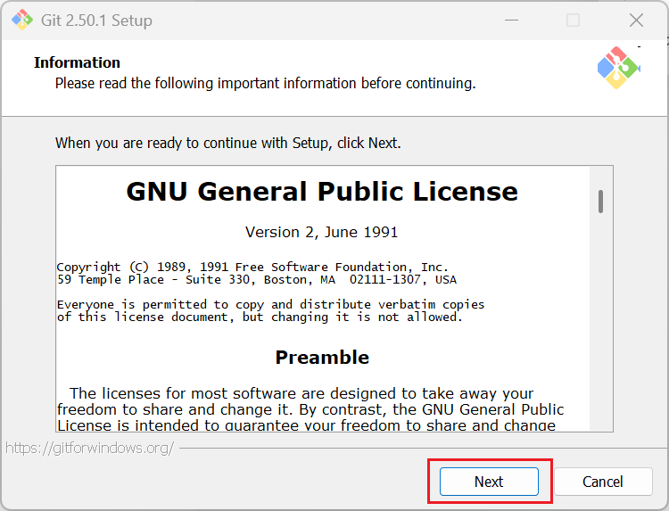

#### 验证Git安装

安装完成后，打开命令提示符（CMD），输入以下命令验证是否安装成功：`git --version`。如果显示 Git 版本号（如 `git version 2.49.0.windows.1`），说明安装成功。

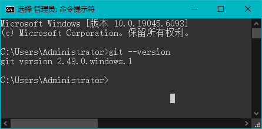

```cmd
C:\Users\Administrator>git --version
git version 2.49.0.windows.1

C:\Users\Administrator>
```

如果 `git` 命令提示找不到，确保 `Git `命令已添加到系统环境变量中。

验证Git环境变量

检查环境变量 `Path` 里有没有 `C:\Program Files\Git\cmd`。

- 右键我的电脑 -> 属性 -> 高级系统设置 -> 环境变量。
- 检查 `Path` 中是否包含 Git 的安装路径（如 `C:\Program Files\Git\cmd`）。如果没有，手动添加。

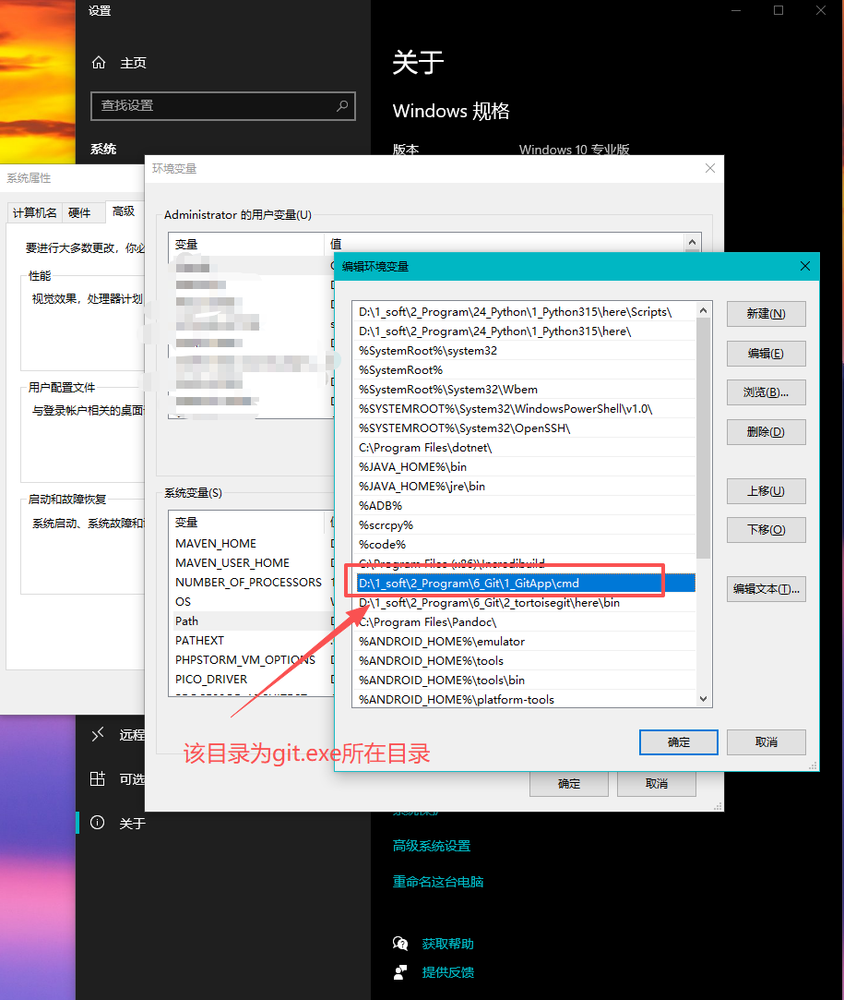

### **数据库选择**

`Gitea` 支持三种数据库：

| 数据库 | 特点 | 适用 |
|--------|------|------|
| `SQLite` | 零配置，数据存为一个文件 | 个人使用，1-5 人小团队 |
| `MySQL` | 需单独安装，并发能力强 | 10 人以上团队 |
| `PostgreSQL` | 功能最强，性能最高 | 有 DBA 的企业环境 |

个人或小团队直接用 **`SQLite`**，不需要额外安装数据库，`Gitea `内置支持。本文以 `SQLite `为主，`MySQL `配置会单列一节。

### `MySQL`配置（可选）

如果你选择 `MySQL `作为 `Gitea `的数据库，则需要先在数据库中创建一个名为 `gitea`的数据库，并创建一个名为 `gitea`的用户。如下图所示：

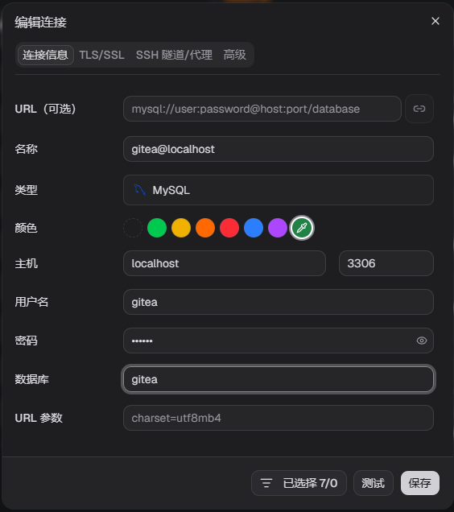

## 三、下载并安装 `Gitea`

中文文档地址：[https://docs.gitea.cn](https://zhuanlan.zhihu.com/p/1887869860391936724/edit)

去 [dl.gitea.com/gitea](https://dl.gitea.com/gitea/) 下载最新版本, 如果是`windows`版本，直接搜索`exe`就好了：

- 64 位 Windows：`gitea-x.xx.x-windows-4.0-amd64.exe`
- 32 位 Windows：`gitea-x.xx.x-windows-4.0-386.exe`

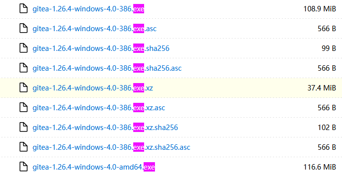

下载后重命名为 `gitea.exe`，在任意位置创建一个目录用于存放 ·文件，例如 `C:\gitea`。

> [!NOTE]
>
> 注意，我们下载的不是安装程序, 而是单文件的可执行程序；故我们可随意移动文件, 你把文件放到哪里, 它就在哪里运行。


## 四、配置详解

### 4.1 运行 `Gitea `初始化配置

打开命令提示符：

```bash
cd C:\gitea
gitea.exe web
```

浏览器访问 `http://localhost:3000`，出现初始化页面即启动成功。

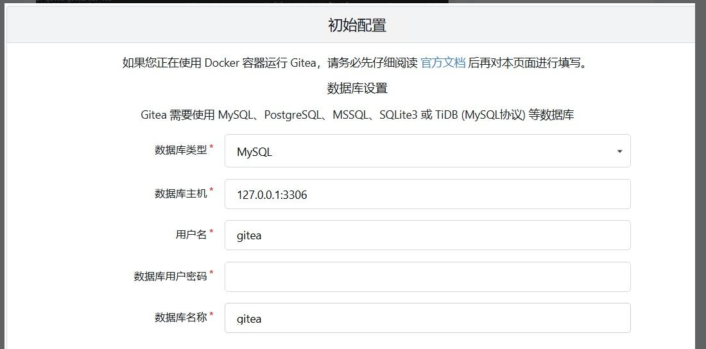

如果你在上一步配置了数据库，这里选择对应的数据库即可。如这里就是设置了仓库名为`gitea`，用户为`gitea`。

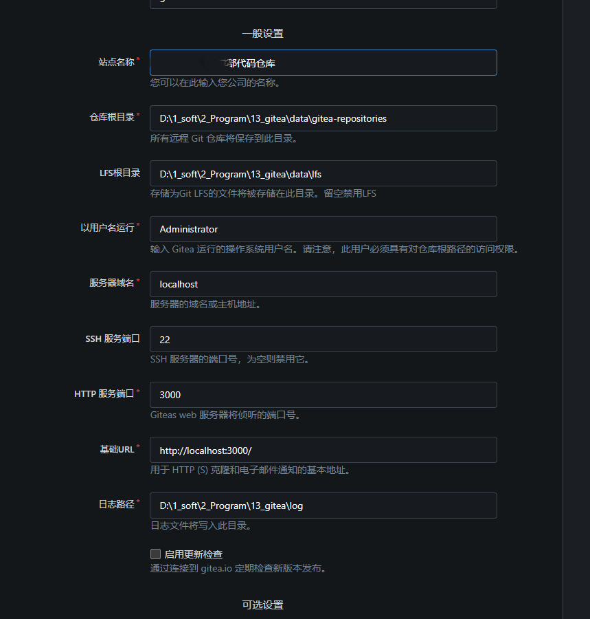

你可以在这里配置站点的一些基本信息，如站点的名称、数据存放的目录、网址、端口号等；不过你随便配置也行，因为此时 `Gitea `会在 `C:\gitea\custom\conf\` 下自动生成配置文件 `app.ini`，你可以之后随时在这个配置文件中修改配置。


### 4.2 修改配置文件（可选）

安装向导填完之后，`Gitea `会自动写入 `app.ini`，你可以手动编辑它来调整配置。

**SQLite 配置（默认，无需改）：**

```ini
[database]
DB_TYPE = sqlite3
PATH    = C:/gitea/data/gitea.db
```

贴一个我的配置文件的部分示例：

```ini
# 文件位于 D:\1_soft\2_Program\13_gitea\custom\conf\app.ini


# APP_NAME : 站点标题，会显示在网页标签栏
APP_NAME = xxxxxxxxxx代码仓库
# RUN_USER : 运行的用户，例如你的windows的用户
RUN_USER = Administrator
# WORK_PATH : 你的 gitea.exe 的目录
WORK_PATH = D:\1_soft\2_Program\13_gitea
RUN_MODE = prod

[database]
# DB_TYPE : 数据库的类型(如果配置为 sqlite3 , 只需要再配置 PATH 即可)
DB_TYPE = mysql
# HOST : 数据库服务的主机地址
HOST = localhost:3306
# NAME : 提供给 gitea 使用的仓库的名称
NAME = gitea
# USER : 提供给 gitea 使用的数据库访问者的用户名
USER = gitea
# PASSWD : 该用户的密码
PASSWD = xxxxxxxxxxxxx
SCHEMA = 
SSL_MODE = disable
# PATH : 如果使用 sqlite3 , 那么 gitea 会自动将数据存放在该文件中
PATH = D:\1_soft\2_Program\13_gitea\data\gitea.db
LOG_SQL = false


[repository]
# 仓库的存放地址
ROOT = D:/1_soft/2_Program/13_gitea/data/gitea-repositories

# 服务器设置
[server]
SSH_DOMAIN = 172.xx.xxx.xxx
# DOMAIN : 改为你的服务器内网IP（如 172.xx.xxx.xxx ）
DOMAIN = 172.xx.xxx.xxx
# HTTP_PORT： Web 访问端口, 如果端口冲突，可以改为其他的
HTTP_PORT = 8082
# ROOT_URL : 访问根目录; 关键配置！
ROOT_URL = http://172.xx.xxx.xxx:8082/
# 应用数据存放地址
APP_DATA_PATH = D:\1_soft\2_Program\13_gitea\data
DISABLE_SSH = true
# SSH 端口，默认 22。如果和系统 SSH 冲突可改其他端口
SSH_PORT = 22
# 启用 Git LFS（大文件存储）支持
LFS_START_SERVER = true
LFS_JWT_SECRET = xxxxxxxxxxxxxxxxxxxxxxxxxxxxxxxxxxx
OFFLINE_MODE = true
# ENABLE_PPROF = true

[lfs]
PATH = D:/1_soft/2_Program/13_gitea/data/lfs
```


## 五、注册为 Windows 服务（开机自启）

每次开机手动跑命令不是办法。把 `Gitea` 注册为 `Windows `服务，随系统自动启动。

以**管理员身份**打开 `CMD`，执行：

```bash
sc create gitea start= auto binPath= "\"C:\gitea\gitea.exe\" web --config \"C:\gitea\custom\conf\app.ini\"" 
```

> 注意: `start=` 和 `binPath=` 后面**必须有一个空格**，这是 `sc` 命令的语法要求。

替换 `C:\gitea` 为你的实际安装路径。

然后启动服务：

```bash
sc start gitea
```

浏览器访问 `http://localhost:3000` 确认服务正常。

服务管理命令：

| 操作 | 命令 |
|------|------|
| 启动 | `sc start gitea` |
| 停止 | `sc stop gitea` |
| 删除服务 | `sc delete gitea` |
| 查看状态 | `sc query gitea` |

后续管理我更推荐使用任务管理器来管理刚才我们创建的系统服务：

打开任务管理器 -> 找到服务标签 -> 如下图所示，找到`g`开头的服务。

然后就可以实时查看服务是否在运行了。

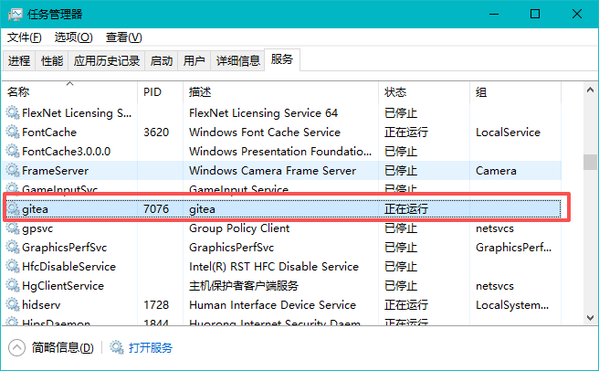

## 六、配置防火墙

如果要从局域网内其他电脑访问，需要在 Windows 防火墙中开放端口。

1. 打开"控制面板" → “系统和安全” -> "Windows Defender 防火墙" → "允许应用或功能通过 Windows Defender 防火墙"
2. 点击"允许其他应用" → 浏览 → 选择 `C:\gitea\gitea.exe` → 添加
3. 确保**专用网络**和**公用网络**都已勾选, 如下图所示。

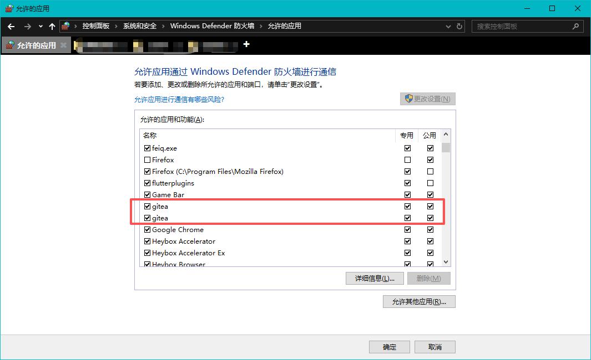

确保开放以下端口：
- HTTP 端口（默认 3000）。
- SSH 端口（默认 22，如果启用了内置 SSH 服务）。

或者在管理员 CMD 中直接添加：

```bash
netsh advfirewall firewall add rule name="Gitea Web" dir=in action=allow protocol=TCP localport=3000
```

如果你启用了 `Gitea `内置 SSH（端口 22），同样需要开放：

```bash
netsh advfirewall firewall add rule name="Gitea SSH" dir=in action=allow protocol=TCP localport=22
```

配置完成后，局域网内其他电脑访问 `http://你的IP:你的端口` 即可。

## 七、初始化和日常使用

### 首次访问 `Gitea`

首次访问 `http://你的IP:你的端口`，按向导完成初始化：

1. **数据库设置** — 配置数据库（如果使用 SQLite，则无需额外安装数据库）或填入 MySQL 连接信息
2. **站点设置** — 仓库根目录、站点标题等，按需修改
3. **管理员账号** — 第一个注册的用户**自动成为管理员**，务必记好密码
4. 点击"立即安装" → 等待配置写入

安装完成后进入登录页，用刚注册的管理员账号登录。

### 测试功能

创建第一个仓库测试：右上角 `+` → 新建仓库 → 填名称 → 勾选"初始化仓库" → 创建。然后本地 clone 试试：

```bash
git clone http://你的IP:你的端口/你的用户名/仓库名.git
```

能正常 push / pull，部署就成功了。

## 使用展示

如下图所示，部署成功之后，`gitea`的使用体验基本和 `github `一致。


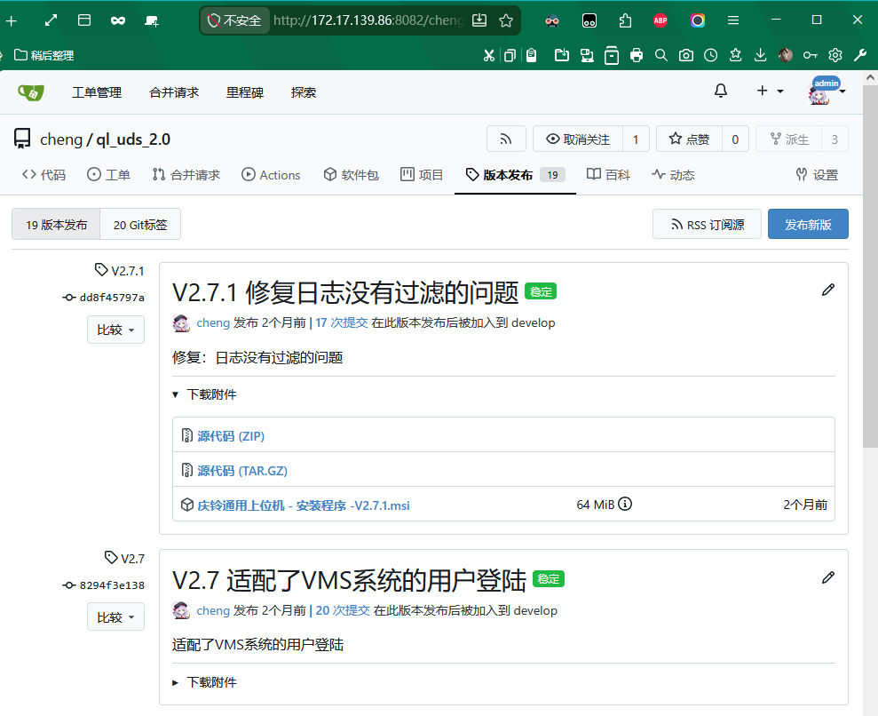

## 总结

自己搭 `Git `服务，三件事：**装 Git → 丢 exe → 配防火墙**。`SQLite`模式下连数据库都不用装，比搭博客还简单。

| 场景 | 推荐方案 |
|------|---------|
| 个人代码备份 | `Gitea `+ `SQLite`，装在本机 |
| 内网小团队（<10人） | `Gitea `+ `SQLite`/`MySQL`，装在共用服务器上 |
| 公司级使用 | `Gitea `+ `MySQL`/`PostgreSQL `+ 内网穿透 |

`Gitea` 把搭建 Git 服务的门槛降到了最低——一个 `exe`，双击即服务。


------

## 参考链接：

知乎用户[慕容小九](https://www.zhihu.com/people/tian-lan-11-27)的博客: [Windows服务器上安装`Gitea`搭建自己的GIT服务器的保姆级教程](https://zhuanlan.zhihu.com/p/1887869860391936724)

`Gitea`官方文档: [https://docs.gitea.cn/installation/install-from-binary](https://docs.gitea.cn/installation/install-from-binary)

