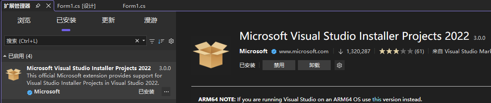
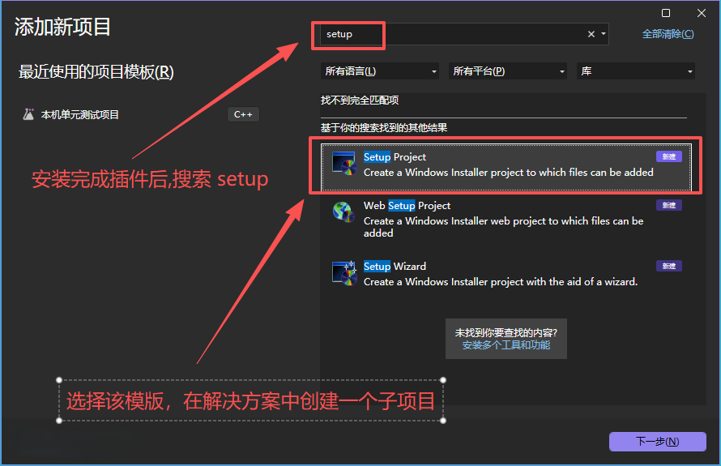
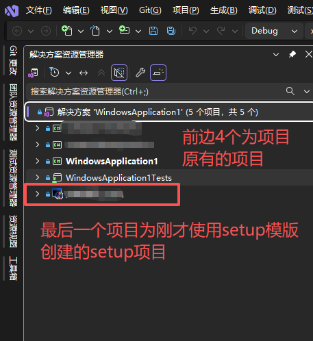
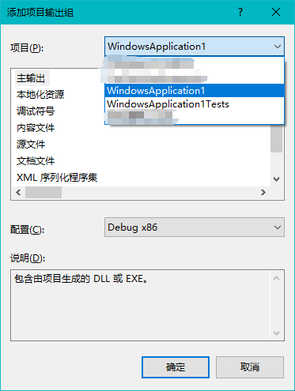
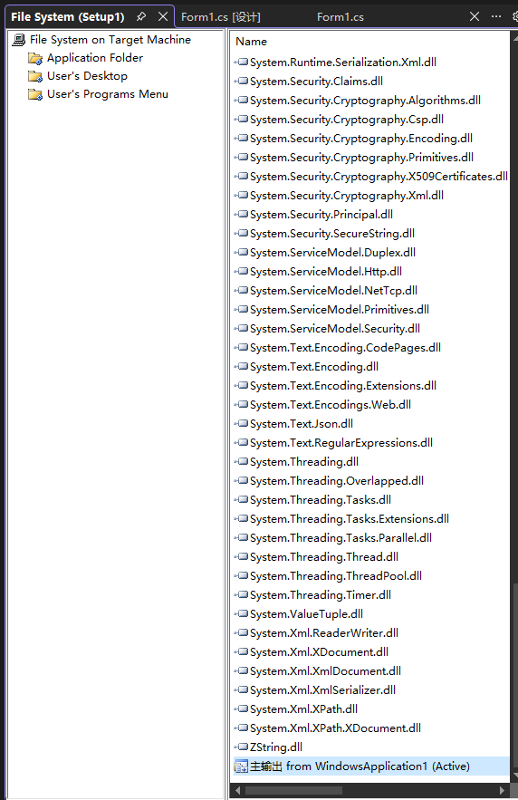
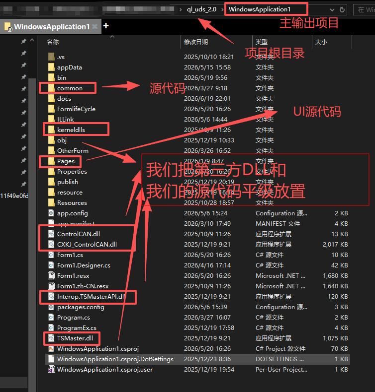
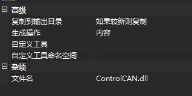
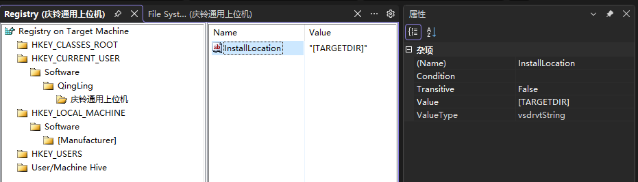
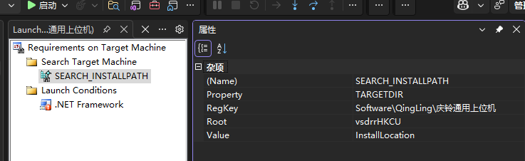
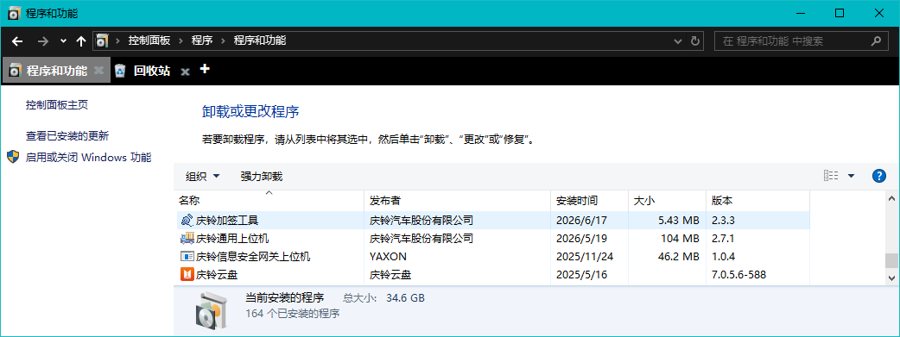

# 将`WinForm`应用打包为独立`EXE`的完整指南

你把 `bin/Debug` 里的 `exe` 发给同事，对方双击后报错："系统找不到指定的文件"。你这才意识到，还得把那一堆 `dll`、`config`、资源文件一起打包——更要命的是，对方电脑可能根本没装 `.NET` 运行时。

本文介绍两种C#应用主流打包方案：**绿色免安装版**（适合简单分发）和 **VS Installer Projects 安装包**（适合正式发布）。

## 一、绿色免安装版：一个文件夹即拷即用

思路很简单：把所有依赖和运行时都塞进同一个文件夹，用户拷贝到任意位置双击 `exe` 即可运行，无需安装，删除即卸载。

### **1.1 适用场景**

- 内部小工具、测试程序、临时使用的辅助工具
- 不希望残留注册表、不创建桌面快捷方式
- 用户群体偏技术，能接受文件夹形式的分发

### **1.2 .NET Framework 项目**

传统的 `.NET Framework 4.x` 的 `WinForm` 项目，编译后的可执行文件依赖于目标系统已安装对应版本的 `.NET Framework`。Windows 10/11 自带 `.NET Framework 4.8`，如果你的项目目标框架匹配，用户一般不需要额外安装运行时。

操作步骤：

1. 将 `Visual Studio` 顶部配置切换为 **`Release`**
2. 生成 → 重新生成解决方案
3. 打开项目目录下的 `bin\Release` 文件夹
4. 将整个 `Release` 文件夹内容打包为 `.zip`，发给用户
5. 用户解压后双击 `YourApp.exe` 即可运行

`Release` 目录中关键文件说明：

| 文件 | 作用 |
| ---- | ---- |
| `YourApp.exe` | 主程序 |
| `YourApp.exe.config` | 配置文件（由 `app.config` 编译而来） |
| `*.dll` | 项目引用的程序集和 NuGet 包依赖 |
| `*.pdb` | 调试符号文件（发布时可删除） |

> `.pdb` 文件仅用于调试，分发给用户时可以删除以减小体积。

### **1.3 .NET Core / .NET 5+ 项目：单文件自包含发布**

这是最推荐的方式——通过 VS 发布功能，将整个应用（含 .NET 运行时）打包成**单个 `exe` 文件**，用户无需安装任何东西。

操作步骤：

1. 右键项目 → **发布**
2. 发布目标选择 **文件夹** → 下一步 → 完成
3. 点击 **显示所有设置**，展开完整配置面板，按以下参数设置：

| 配置项 | 设置值 | 说明 |
| ------ | ------ | ---- |
| 配置 | `Release` | 任意 CPU 或指定 `x64`/`x86` |
| 目标框架 | `net8.0-windows` | 按你的项目实际版本 |
| 部署模式 | **独立** | 将 .NET 运行时打入包中，用户无需安装 |
| 目标运行时 | `win-x64` | 64位 Windows，按需也可选 `win-x86` |
| 文件发布选项 | ✅ 生成单个文件 | 所有内容合并为一个 `exe` |

4. 点击 **发布**，等待编译完成
5. 发布完成后，在输出目录（默认为 `bin\Release\net8.0-windows\win-x64\publish\`）中得到一个 `YourApp.exe`
6. 直接把这个 `exe` 发给用户，双击运行

对应的 `.csproj` 配置（手动编辑也可达到同样效果）：

```xml
<Project Sdk="Microsoft.NET.Sdk">
  <PropertyGroup>
    <OutputType>WinExe</OutputType>
    <TargetFramework>net8.0-windows</TargetFramework>
    <UseWindowsForms>true</UseWindowsForms>
    <PublishSingleFile>true</PublishSingleFile>
    <SelfContained>true</SelfContained>
    <RuntimeIdentifier>win-x64</RuntimeIdentifier>
  </PropertyGroup>
</Project>
```

### **1.4 绿色版的注意事项**

- 自包含打包后体积约 70MB+（含运行时），如果介意体积，改用"框架依赖"模式，但需用户自行安装对应版本的 `.NET Runtime`
- 程序内部涉及路径时，用 `Application.StartupPath` 而非 `Environment.CurrentDirectory`，避免因启动方式不同导致路径错乱
- 如需携带配置文件，检查文件属性中 "复制到输出目录" 是否设为 "始终复制"
- 绿色版没有卸载程序，也不会在 "添加或删除程序" 中留下记录，适合"即用即弃"的工具


---

## 二、`Microsoft Visual Studio Installer Projects` ：制作标准安装包

绿色版虽然方便，但如果你的程序需要创建桌面快捷方式、写入注册表、在控制面板中提供卸载入口、检查系统环境……绿色版就力不从心了。这时需要 **`Microsoft Visual Studio Installer Projects`**，生成规范的 `.msi` 安装包。

> 此扩展原名 "Microsoft Visual Studio Installer Projects"，在 VS 2022 中同样可用。安装后会新增 **Setup Project** 项目模板。

### **2.1 安装扩展**

1. VS 菜单栏 → **扩展** → **管理扩展**
2. 搜索 **"Microsoft Visual Studio Installer Projects"**
3. 点击 **下载**，关闭 VS 后会弹出 VS Installer
4. 在 VS Installer 中勾选刚下载的组件 → 点击 **修改** → 等待安装完成
5. 重新打开 VS



如图所示, 安装完成后, 可以在扩展管理器中看到插件已安装。

### **2.2 创建 Setup 项目**

1.右键 **解决方案** → **添加** → **新建项目**

2.搜索框输入 `setup` → 选择 **Setup Project** 模板



命名为 `YourApp.Setup` → 下一步 → 创建

此时解决方案中多了一个 Setup 项目。选中它，属性窗口下方会显示项目的属性面板。



### **2.3 文件系统编辑器：决定"装什么、装到哪"**

文件系统编辑器是打包的核心界面。右键 Setup 项目 → **View** → **文件系统**，打开后看到三个虚拟文件夹：

| 文件夹 | 含义 | 映射到用户电脑的实际路径 |
| ------ | ---- | ------------------------ |
| Application Folder | 程序主目录 | 用户选择的安装路径（默认 `C:\Program Files\YourApp`） |
| User's Desktop | 用户桌面 | `C:\Users\用户名\Desktop` |
| User's Programs Menu | 开始菜单 | `C:\Users\用户名\AppData\Roaming\Microsoft\Windows\Start Menu\Programs` |

右键 Setup 项目 → **View** → **文件系统** 打开界面之后：

#### **步骤1：添加主程序文件**

- 右键 **Application Folder** → **Add** → **项目输出**
- 在弹出的对话框中：项目选你的 `WinForm` 主项目 → 选择 **主输出** → 确定。如果你的解决方案有多个项目，请选择你的主要自动项目。



- 此时, VS 会自动分析依赖，将主 `exe` 及其引用的 `dll` 一并纳入



此时 `Application Folder` 下会出现"主输出 `from YourProject (活动)`"，以及自动检测到的依赖项（如 `Microsoft.CSharp` 等系统程序集）。

用户在安装的时候，安装程序会一并将这些文件全部都安装到安装目录下。

为了提高用户的使用体验，用户打开文件夹，看到一堆的`dll`文件，找不到程序入口，难免会觉得心烦。你可以手动选中这些`dll`文件，然后右键属性，设置为隐藏，这样，用户打开后，如果他的文件夹设置了隐藏，就只会看到一个干净的`exe`文件。

#### **步骤2：添加额外内容文件**

如果你的项目中有配置文件、数据库模板、资源文件等需要一起部署，同样右键 **Application Folder** → **Add** → **文件**，选择对应文件添加。

关注 `YourApp.exe.config`（`app.config` 的编译产物）是否已被自动包含——在解决方案资源管理器的主项目中找到 `app.config`，右键 → 属性 → "复制到输出目录"设为"始终复制"，否则发布后可能缺失。

##### 额外的`dll`如何添加到项目进行管理？

就比如说我们的上位机开发，有一些`dll`是通过复制的方式加入到我们的解决方案中的, 比如说我们周立功的"`ControlCAN.dll`"以及同星的"`TSMaster.dll`"，加了他们的`dll`之后，我们的上位机才具备打开他们`CAN`卡的能力。但是通过刚才的步骤一， setup 插件并不会将这些`dll`给包含进来，插件只会包含通过引用加进来的依赖。所以，我们在这一步，需要额外通过添加资源文件的方式，将这些`dll`加进来。

```
├── ControlCAN.dll (周立功CAN卡的DLL驱动，通过复制的方式加入到项目中，插件不会自动打包)
├── kerneldlls (周立功CAN卡的DLL驱动文件夹，同样的，插件不会自动打包)
├── TSMaster.dll (同星的CAN卡驱动DLL，同理)
├── YourApp.exe (你的应用程序入口)
```

那我们怎么做呢？

首先，我们将这些额外的项目依赖复制到我们的项目的源代码目录下， 和`xxxxxxxx.csproj`文件平级，也就是和你的 `Program.cs`文件平级。




其次，我们打开`.csproj`文件，这个文件是`c#`的项目配置文件, 在里边添加以下节点：

```xml
<ItemGroup>
    <Content Include="kerneldlls\**">
        <CopyToOutputDirectory>PreserveNewest</CopyToOutputDirectory>
    </Content>
</ItemGroup>
<ItemGroup>
    <Content Include="ControlCAN.dll">
        <CopyToOutputDirectory>PreserveNewest</CopyToOutputDirectory>
    </Content>
</ItemGroup>
```

这样，这些文件就会在编译的时候，自动复制到对应的目录，例如"`Debug/Release`"目录下，而不需要我们每次手动把文件复制到对应的目录下。并且，这样的一个好处是，可以使用`git`进行项目管理了。因为通常，我们是不会把`Debug/Release`目录给上传到`git`的，把项目输出上传到`git`是不规范的，但是如果你又把这些额外的项目依赖直接放到里边，那么在上传的时候这些文件就会丢失（要么就不规范）。所以，我们在`.csproj`文件中，标记` <CopyToOutputDirectory>PreserveNewest</CopyToOutputDirectory>`是最标准的做法，VS会在文件更新的时候，自动复制到输出目录。

同样，如果你不习惯使用文件的方式编辑生成方式，你也可以直接在解决方案资源管理器中，直接对着文件右键属性，将生成操作设置成"如果较新则复制"。



然后这个时候，你就可以继续上边的操作了，右键 **Application Folder** → **Add** → **文件**，选择对应文件添加进来即可，这个时候，你在文件视图中就可以看到，这些`dll`被打包进来了。


##### 额外的资源文件如何添加到项目进行管理？

同样的，我们会有一些其他文件也需要一起复制到项目的输出目录，例如我们的`pdf`格式的用户使用手册，`json`格式的配置文件，这些文件不会在编译的时候链接到项目中，所以`vs`不会帮我们给复制到项目输出目录，setup插件默认也不会将这些文件给打包起来。

当然，你也可以按照上边的步骤，将文件一个一个加进来，但是这样太费时间了，这里介绍一个新的方法。在解决方案管理器中，对着文件右键属性，设置文件的生成操作；常见的生成规则有4种：无、编译、嵌入的资源、内容；上边的图中，你也看到了，我们将`ControlCAN.dll`的生成操作设置为了内容。

我们将需要复制到输出目录的所有文件的生成操作都设置为内容后，右键 **Application Folder** → **Add** **→ 内容文件**， 这样，setup插件就会把刚才我们标记的所有内容文件一起复制到exe所在的目录下了。这样的好处就是非常方便项目的管理。


#### **步骤3：创建快捷方式**

- 在 **Application Folder** 中，找到 "主输出 `from YourProject`"
- 右键 → **`Create Shortcut to 主输出 from YourProject`**
- 将生成的快捷方式重命名为你的应用名称（如 `我的工具`）
- 把该快捷方式**拖入** `User's Desktop` 文件夹 → **用户桌面出现图标**
- 再拖一份到 `User's Programs Menu` 文件夹 → **开始菜单出现图标**

设置快捷方式图标：

1. 先将 `.ico` 图标文件通过右键 Application Folder → Add → 文件 添加进来
2. 选中快捷方式 → F4 打开属性窗口(或者右键属性打开属性窗口)
3. 找到 `Icon` 属性 → 下拉选择 `(Browse...)` → 在弹出的对话框中双击` Application Folder` → 选择你刚添加的 `.ico` 文件 → 确定


### **2.4 注册表编辑器：写入安装信息**

右键 Setup 项目 → **View** → **注册表**，可在安装时写入注册表键值。常用场景：记录安装路径、写入程序配置。

示例：在 `HKEY_CURRENT_USER\Software\[Manufacturer]\[ProductName]` 下写入安装路径：

1. 展开 `HKEY_CURRENT_USER` → 展开 `Software` → 右键 `[Manufacturer]`(可能需要手动创建) → 新建 → 字符串值
2. 命名为 `InstallLocation`，值设为 `[TARGETDIR]`（安装程序会自动替换为实际安装路径）



如图所示，将注册表项`InstallLocation`的值设置为 `[TARGETDIR]`之后，每次触发安装时，安装程序都会自动给这个注册表项写入安装目录进去。

#### 如何实现自动记忆安装目录？

那我们如何使用这个注册表，在软件更新时(覆盖安装)，实现自动记忆安装目录呢？别急，听我慢慢讲来。

设置了注册表之后，第一次安装时，就会记录当前的安装目录。

我们右键 Setup 项目 → **View** -> 启动条件 ，打开启动条件视图，如下图所示。



- 首先，右键 `Search Target Machine`(搜索目标机器) -> 添加注册表搜索 -> 命名为 `SEARCH_INSTALLPATH`(名字可以随便取)；
- 然后，设置搜索的注册表键为 我们上一步设置的注册表键，也就是设置 `RegKey`，我这里是这设置的是 `Software\QingLing\庆铃通用上位机`(你按照你实际的来写)，安装程序就会到这个注册表文件下去搜索注册表。
- 接着，我们指定搜索的注册表名称，还记得我们刚才是把安装目录保存到了哪里吗？`InstallLocation`变量中，所以这里，我们将`Value`设置为 `InstallLocation`。安装程序就会自动获取这个变量的值。
- 最后，我们拿到值了之后，需要执行一个什么操作呢？当然是设置当前安装目录呢，我们设置`Property`变量为 `[TARGETDIR]`，安装程序就会自动把找到的上一次的目录给设置到这个变量中来，也就是本次的安装目录。
- 另外，你可能还想问，如果我这样设置了之后，那第一次安装的时候，程序岂不是完全不知道安装到哪里？你问得完全没错，因为我们还有一步没有设置，也就是设置程序的默认安装目录。
- 最后的最后，右键 **Application Folder** -> 属性 -> 设置 `DefaultLocation`为`C:\App\[Manufacturer]\[ProductName]`，安装程序会自动在C盘的`App`目录下创建`你的公司名\你的产品名`的文件夹，最后就会把你的程序安装到里边。

> [!NOTE]
>
> Application Folder的 `Property`属性不要乱动，保持默认`TARGETDIR`就好，否则刚才的几个步骤都会失效，这个属性的意思就是说，我的应用程序的目录是保存在哪个变量下的。


> 如果只是简单打包，可以跳过注册表配置。

### **2.5 用户界面编辑器：自定义安装向导的外观**

右键 Setup 项目 → **View** → **用户界面**，可以看到安装过程的界面树：

```
安装
├── 启动
│   ├── 欢迎使用
│   ├── 选择安装文件夹 ← 用户选择安装路径
│   ├── 确认安装
│   └── 进度
└── 结束
    ├── 完成
```

每项都可以右键 → 上移/下移/删除来调整顺序。选中某项，在属性窗口中可修改标题文字等。

常见修改：选中"欢迎使用" → 属性中 `BannerBitmap` 可替换为自定义横幅图（需为 `.bmp` 格式，尺寸 500×70 像素）。

### **2.6 配置 Setup 项目属性**

选中 Setup 项目（不是其下的文件夹），F4 打开属性窗口，也可以右键 Setup 项目点击属性打开属性窗口，关键配置：

| 属性 | 说明 | 推荐设置 |
| ---- | ---- | -------- |
| `AddRemoveProgramslcon` | 图标(安装完成后，在你的控制面板中显示的图标) | 仅支持`ico`格式的图标文件，你可以到网上执行制作，并放到项目文件夹下 |
| `Author` | 作者 | 你的名字 |
| `Description` | 项目描述 | 项目描述 |
| `Manufacturer` | 制造商/公司名 | 你的工作室名称，会显示在控制面板中 |
| `ProductName` | 产品名称 | 应用的中文名，会显示在控制面板中 |
| `Version` | 版本号 | `1.0.0`，每次发布必须递增，会显示在控制面板中 |
| `RemovePreviousVersions` | 安装前自动卸载旧版（可实现自动的覆盖安装） | `True`（配合递增 Version 使用） |
| `DetectNewerInstalledVersion` | 检测已安装版本是否更新 | `True` |
| `TargetPlatform` | 目标平台 | `x64` 或 `x86`，建议`x86`以增加兼容性 |

> [!NOTE]
> 特别提醒！！`RemovePreviousVersions` 为 `True` 时，**必须每次发布递增 `Version`，且 `ProductCode` 和 `UpgradeCode` 保持自动生成即可**。Version 不变则不会覆盖安装。



如图所示，你在Setup 项目属性中设置的这些值，最后都会显示在控制面板中。如果设置了图标，还会显示图标，没有设置，就只会显示一个默认图标。

### **2.7 配置 .NET Framework 启动条件**

Setup 项目默认会添加 `.NET Framework` 启动条件：安装前检测目标电脑是否安装了所需版本，未安装则弹窗提示。

右键 Setup 项目 → **View** → **启动条件**：

- `.NET Framework` 节点下会列出检测项
- 选中后，属性窗口中 `Version` 即要求的框架版本
- 如果你的目标框架是 `.NET Framework 4.8`，确保此处版本匹配

对于 `.NET Core / .NET 5+` 自包含发布的项目，不需要启动条件（运行时已内嵌），可以删除它。

### **2.8 配置安装程序输出**

右键 Setup 项目 → **属性**（或选中后 F4），与普通的 C# 项目属性不同，这里重点看：

- **输出文件名**：默认 `Setup.msi`，可按需改为 `YourApp_Setup.msi`
- **打包文件**：设为"在安装文件中"（默认），不要选"松散未压缩文件"
- **压缩**：建议选 `Optimized for size`

### **2.9 生成安装包**

1. 确保 VS 顶部配置为 **`Release`**
2. 右键 Setup 项目 → **生成**（或右键 → 重新生成）
3. 生成完成后，打开 Setup 项目的 `bin\Release`（或 `bin\Debug`）目录，得到两个文件：

```
YourApp.Setup\bin\Release\
├── Setup.exe          ← 引导程序（发给用户时保留）
└── YourApp_Setup.msi  ← 安装包主体
```

将这两个文件一起发给用户。推荐将整个文件夹压缩为 `.zip` 分发。或者直接把`msi`文件发给用户即可。

### **2.10 用户端安装体验**

用户拿到压缩包后：

1. 解压 → 双击 `Setup.exe`
2. 欢迎页面 → 下一步
3. 选择安装路径（默认 `C:\Program Files\YourApp`）→ 下一步
4. 确认安装 → 下一步 → 等待进度条走完
5. 安装完成 → 可选"启动程序"

安装后，桌面和开始菜单均有快捷方式。需要卸载时：

- 开始菜单找到程序文件夹 → 点击"卸载"
- 或 控制面板 → 添加或删除程序 → 找到你的应用 → 卸载


### 2.11 版本控制

通常，2.9 步骤中所生成的`exe`文件和`msi`文件，是不能够加入到项目中进行管理的，所以我们需要设置git的忽略文件，把这一类后缀的文件都给忽略进去。

同时，我们这个setup项目本身呢，则是以`.vdproj`文件的方式，保存在你刚才新建的setup项目目录中，而这一个文件是需要使用git进行管理的，刚才我们设置的所有内容都会保存在里边，方便进行版本控制。

> [!NOTE]
>
> 在新的电脑上克隆项目的时候，如果目标电脑的VS没有安装这一个官方插件，则会显示报错，提示我们无法打开这个项目。这个时候，你只需要在新电脑上，安装微软的这一个官方插件即可。


### **2.12 常见问题**

**Q: 生成时提示"找不到文件或程序集"**

通常是依赖没有正确引入。在 Solution Explorer 中检查主项目的"引用"节点，确保所有 NuGet 包均正常安装。右键主项目 → 清理 → 重新生成 → 再生成 Setup 项目。

**Q: 快捷方式图标不显示**

`.ico` 文件必须包含多种尺寸（至少 16×16、32×32、48×48、256×256），用 [Greenfish Icon Editor](https://greenfishsoftware.blogspot.com/) 等工具制作多分辨率 `.ico`。

**Q: 安装后运行闪退或报错**

首先检查 `Application.StartupPath` 相关的路径逻辑（见第一章注意事项）。其次检查配置文件是否正确生成——在安装目录下确认 `YourApp.exe.config` 存在且内容正确。

**Q: 如何实现安装包自动升级**

保持 `UpgradeCode` 不变，每次发布递增 `Version`，设置 `RemovePreviousVersions = True`、`DetectNewerInstalledVersion = True`。用户运行新版安装包时，会自动卸载旧版再安装新版，用户数据（如数据库文件）不会丢失。

---

## 总结

|  | 绿色免安装版 | VS Installer Projects |
| -- | ------------ | --------------------- |
| 分发形式 | `.exe` 或 `.zip` 文件夹 | `.msi` + `Setup.exe` |
| 安装过程 | 无，解压即用 | 向导式安装 |
| 注册表 | 不写入 | 可写入 |
| 快捷方式 | 需手动创建 | 自动创建 |
| 卸载 | 删除文件夹 | 控制面板或开始菜单卸载 |
| 适用场景 | 内部工具、临时分发 | 正式产品、客户分发 |
| 用户体验 | 技术用户友好 | 普通用户友好 |

简而言之：**内部用、图省事 → 绿色免安装版；正式发、给客户 → Installer Projects。**
