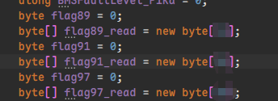
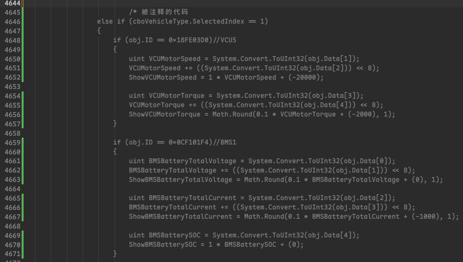
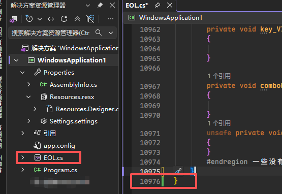
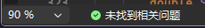
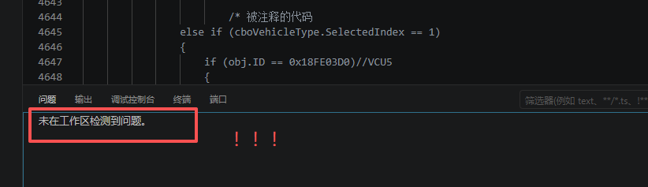
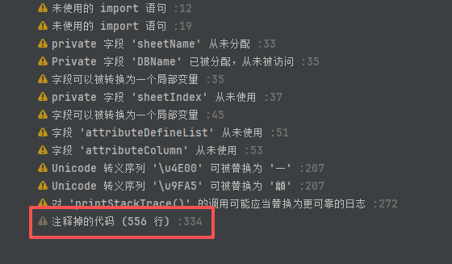

# `Kotlin`的设计哲学之：弃用标记

> `Jetbrains`的工程师们，是我见过最优雅，最具有工程师精神的一批工程师。

我先不说为什么，这句话先放在这里，我看谁要来反驳；别急，你接着往后看。

## 一、前言

不知道你们有没有接手过其他同事的屎山代码，整个项目只有一个类文件，代码行数多达一万多行，一堆全局变量，变量命名全靠猜，程序逻辑不清晰，`if - else`嵌套了18层，注释是一个没有的，注释掉的代码却多达几百行。

准备好你的小心脏，下边可以看一下：

**众多意义不明的全局变量们**：



**800行被注释的代码**：



**单文件一万行的项目：**



我接手过这样的项目，所以我很清楚这里边的痛苦；我没有在原来的屎山之上继续增加，而是花了大概一周的时间详细看整个项目，了解了整个项目的功能和逻辑，给必要的地方加上注释；最后，我按照我的思路，把整个项目推翻重写了一遍。

我问同事这些被注释的代码是什么意思，是准备之后再来修改并重新启用吗，还是说可以删掉的无用代码。同事说，太久了，他也不知道什么意思，但是也不能删，因为有可能是有用的代码。

看吧，这就是写代码不规范造成的影响。

但是，前边的这么多缺陷，咱们今天不讲；本文只讲函数的弃用和注释，谈一谈代码规范的问题。

## 二、各类IDE如何处理这类问题

好，我们回到正题上边来，为什么说`Jetbrains`的设计师们，是我见过最优雅，最具有工程师精神的一批工程师。

使用`Visual Studio`写`C#`代码，写`C++`代码，如果你像上图那样，注释了大量的代码，IDE(集成开发环境)不会给你任何提示，只会给你一个绿绿的标，甚至还说"未找到相关问题"，如下图所示：



使用`VSCODE`也是一样的，默认不会给你提示。

> 但是我感觉`VSCode`应该是有相关的代码风格检测的插件。



我用过的这么多`IDE`中, 只有`Intellij IDEA`一家，会在代码被注释掉时，直接黄标警告你，如下图所示。



你说这群`Jetbrains`的工程师是不是事多？多大一点事，我就把代码注释掉了而已，还警告我。是啊，我一开始也不懂；可是随着我知识越来越丰富，更能写出高内聚低耦合的代码，更能写出易于修改和维护的代码时；我越来越明白代码的规范是多么重要，我终于理解了这群`Jetbrains`的工程师。

是的，他们用心良苦，为了防止你们写出不规范的代码，他们甚至想要手把手教你。**被注释掉的代码**，一开始没什么大不了；可是随着项目逐渐变大，人员流动，这一段代码是要准备之后再解封吗，还是可以直接删了，就变得不明确了。**被注释掉的代码**会给之后维护的工程师造成非常大的困扰，让项目变得难以维护。

那我们应该如何处理这类问题呢？这类临时需要被注释掉的代码，之后可能会在某一段时间又解封，我应该用什么方式去描述呢？有没有一种方法，可以准确的描述这个事情。有的，兄弟，有的有的，你要的都有。其实各类编程语言早就想到这个需求了，这个东西就叫**弃用标记**；各类编程语言实现的方式不同，有的语言直接在注释里语法高亮，有的用装饰器，有的用注解，有的用特性来表达这个函数被弃用了，下边我将来详细介绍这一用法。

## 三、使用弃用注解

弃用标记不是 `Kotlin` 的发明，几乎所有主流语言都有这个特性。`Java` 里有 `@Deprecated`，`C#` 里有 `[Obsolete]`，`Python` 里用装饰器，`JavaScript` 用 JSDoc 注释。它们的语义相同：告诉调用者"这个东西以后会删，别再用了"。

但 `Kotlin` 把这个特性做到了极致——它不仅告诉你"别用"，还告诉你"用这个替代"。这就是 **`ReplaceWith`**。

**3.1 基础用法**

```kotlin
@Deprecated("请使用 newFunction() 替代")
fun oldFunction() {
    // ...
}
```

IDEA 会在所有调用了 `oldFunction()` 的地方加一条删除线，鼠标悬停显示提示信息。但这还不够——调用者知道别用旧的，却不知道新的长什么样，还得自己去翻文档。

**3.2 ReplaceWith：一键迁移**

```kotlin
@Deprecated(
    message = "此方法已废弃，请使用 calculateV2()",
    replaceWith = ReplaceWith("calculateV2(a, b)"),
    level = DeprecationLevel.WARNING
)
fun calculateV1(a: Int, b: Int): Int {
    return calculateV2(a, b)
}
```

这样做有两个好处：

1. IDEA 在警告中直接显示替换方案，调用者不需要查文档
2. 调用者可以通过 `Alt + Enter` → `Replace with calculateV2(a, b)` **一键自动重构**——不是手动改，是 IDE 帮你改

`ReplaceWith` 支持参数映射，换函数签名也毫无压力：

```kotlin
@Deprecated(
    message = "使用 formatName(fullName: String, title: String) 替代",
    replaceWith = ReplaceWith("formatName(name, title)")
)
fun formatName(title: String, name: String) {
    // 参数顺序变了，replaceWith 自动帮你调换
}

fun formatName(fullName: String, title: String) {
    // 新函数
}
```

**3.3 DeprecationLevel：三个等级**

| 等级 | 效果 | 使用场景 |
|------|------|---------|
| `WARNING`（默认） | 黄色警告，编译通过，运行正常 | 刚废弃，给调用者留缓冲期 |
| `ERROR` | **红色错误**，编译失败，除非调用者加 `@Suppress` | 确定要删，强制迁移 |
| `HIDDEN` | 完全不可见——对外部调用者来说这个函数已经不存在了 | 内部保留实现，新版本中彻底移除入口 |

**WARNING — 缓冲期：**

```kotlin
@Deprecated(
    "此方法计划在 v3.0 移除",
    level = DeprecationLevel.WARNING
)
fun legacyMethod() { }
```

**ERROR — 强制执行：**

```kotlin
@Deprecated(
    "此方法已于 v2.5 移除，请使用 newMethod()",
    level = DeprecationLevel.ERROR
)
fun removedMethod() { }
```

调用者编译直接报错，除非显式加 `@Suppress("DEPRECATION")` 强行压制——但压制只给短期绕过，不给长期无视。

**HIDDEN — 直接消失：**

```kotlin
@Deprecated(
    "此 API 已在 v3.0 移除",
    level = DeprecationLevel.HIDDEN
)
fun completelyRemoved() { }
```

`HIDDEN` 的妙用：函数的实现还在（内部代码仍可调用），但对外部使用者来说就像不存在一样。适合分阶段删除——先 `HIDDEN` 一段时间观察，确认内部也没有调用了再删代码。

**3.4 实战案例：一个合理的弃用演进**

假设你负责一个网络请求库，v1.0 的设计是这样的：

```kotlin
class ApiClient {
    fun fetchUsers(): List<User> {
        // 同步请求，会阻塞线程
    }
}
```

v2.0 你想改成协程，直接改？不行，调用方全崩。正确的演进：

```kotlin
class ApiClient {
    @Deprecated(
        message = "fetchUsers() 已废弃，请使用 suspend 版的 fetchUsersAsync()",
        replaceWith = ReplaceWith("fetchUsersAsync()"),
        level = DeprecationLevel.WARNING   // v2.0: 先警告
    )
    fun fetchUsers(): List<User> { ... }

    suspend fun fetchUsersAsync(): List<User> { ... }
}
```

v2.5 时把等级升为 `ERROR`，v3.0 时升为 `HIDDEN` 或直接删除。整个过程调用者被逐步引导迁移，不会被突然破坏。

> 这就是 `JetBrains` 工程师的优雅：他们设计了弃用标记，自己也严格遵守。你在 `Kotlin` 标准库里随处可见这种用法——一个函数被废弃，`@Deprecated` 不仅告诉你废止理由，`ReplaceWith` 精确指出替代方案。正是因为这种严谨，`Kotlin` 语言版本的升级才能做到几乎无痛兼容。

---

## 四、使用 `TODO` 标记

弃用注解解决了"旧东西怎么删"的问题。那么反过来——新功能还没写完，怎么标记？

直觉做法是注释掉未完成的代码，留一句 `// 这里还要改`。但这和第一节的注释一样——时间一长谁也记不起来。`Kotlin` 提供了两个层面的 TODO 机制：**函数级的 `TODO()`** 和 **注释级的 `// TODO`**。

**4.1 TODO()：不写完就编译不过**

```kotlin
fun calculateDiscount(price: Double): Double {
    TODO("根据用户等级计算折扣，待业务方确认规则")
}
```

`TODO()` 的返回值类型是 `Nothing`，意味着它可以放在任何需要返回值的地方。**运行时直接抛 `NotImplementedError`**，不会静默地返回一个假数据。

它的本质是：

```kotlin
public inline fun TODO(reason: String): Nothing =
    throw NotImplementedError("An operation is not implemented: $reason")
```

用 `TODO()` 而不是注释的好处一目了然：

| 做法 | 编译 | 运行时 | 被遗忘的概率 |
|------|------|--------|------------|
| `// 待完成` 注释掉 | ✅ 通过 | 跳过逻辑，返回默认值 | 极高 |
| `TODO("待完成")` | ✅ 通过 | **崩溃**，带明确原因 | 极低 |

崩溃不是坏事——它强迫你在上线前完成这段代码，而不是悄悄上线一个半成品。

**4.2 // TODO 注释：IDEA 的全局巡检**

函数级的 `TODO()` 是运行时兜底，而 `// TODO` 注释是 IDE 级别的静态追踪。

在 IDEA 中，所有 `// TODO`（以及 `// FIXME`）注释会被自动收录到 TODO 工具窗口（`View → Tool Windows → TODO`），变成一张全局待办清单：

```
// TODO: 改用协程替换 Thread.sleep
// FIXME: 此处数据库连接的线程安全问题
// TODO(user): 确认国际化的语言列表，目前只有中英文
```

你可以加作者标签 `TODO(name)`，多人协作时各看各的待办。IDEA 支持按关键词、文件范围、作者筛选和过滤。

**4.3 离职不是炸弹**

说到这个，我有朋友就刚好遇到过这种情况，之前负责某一块业务的同事离职了，然后交接的时候记着说了一堆，他还以为自己记得住，结果过了一个星期，自己已经忘得一干二净了。

如果你用的是 `// TODO`，IDEA 里打开 TODO 窗口，不管你项目多大、逻辑多散，所有待办一目了然。不需要翻遍文件去找"之前好像哪里没写完"。

**4.4 组合使用**

弃用和 TODO 不是互斥的，二者配合刚好覆盖整个代码生命周期：

```kotlin
// 告诉后来人：这个函数要删了
@Deprecated(
    message = "v2.0 起废弃，请迁移至 processOrderV2()",
    replaceWith = ReplaceWith("processOrderV2(order)"),
    level = DeprecationLevel.WARNING
)
fun processOrder(order: Order) { ... }

fun processOrderV2(order: Order) {
    // 新逻辑
    TODO("待对接支付接口后完成")
}
```

旧函数用 `@Deprecated` 引导迁移，新函数里未完成的步骤用 `TODO()` 占位——责任清晰，不怕交接。

---

## 总结

回到开头那句话：`JetBrains` 的工程师们，是我见过最优雅、最具有工程师精神的一批工程师。他们设计的弃用标记体系——`@Deprecated` + `ReplaceWith` + `DeprecationLevel` 三级等级，以及 `TODO()` 函数的"不写完就崩溃"的强硬态度——从头到尾只在做一件事：**让代码的意图被准确表达**。

被注释掉的代码表达的是什么？不确定性："我可能要用，可能不用，我不知道"。`@Deprecated` 表达的是确定性："这个我确定不用了，请用那个替代"。`TODO()` 表达的也是确定性："这个我确定还没写完，碰了会炸"。

下次你想注释掉一段代码时，停一秒钟：旧的该废弃就用 `@Deprecated`，没写完的用 `TODO()`，而不是留下一地注释让后来人猜。

这就是工程精神：**不是写代码给别人看，而是写代码让别人能接住。**
