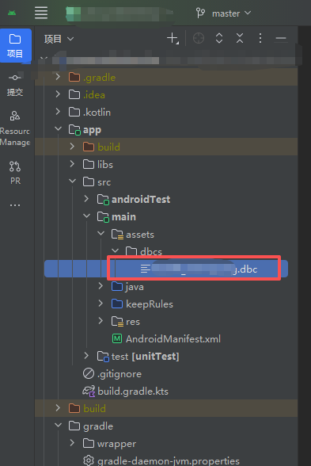
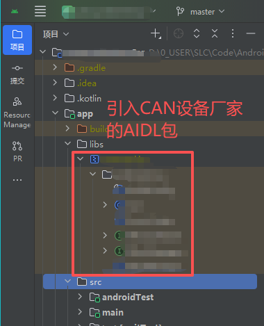
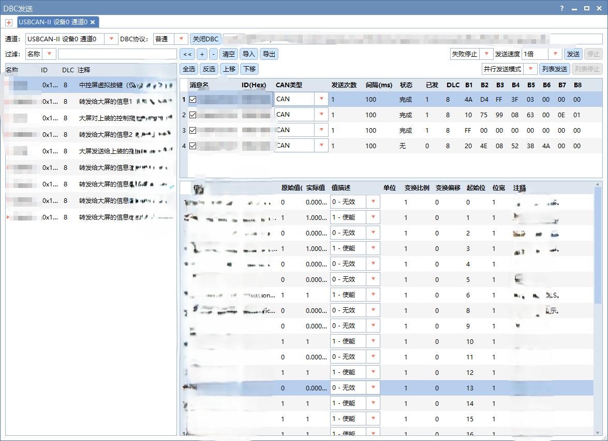
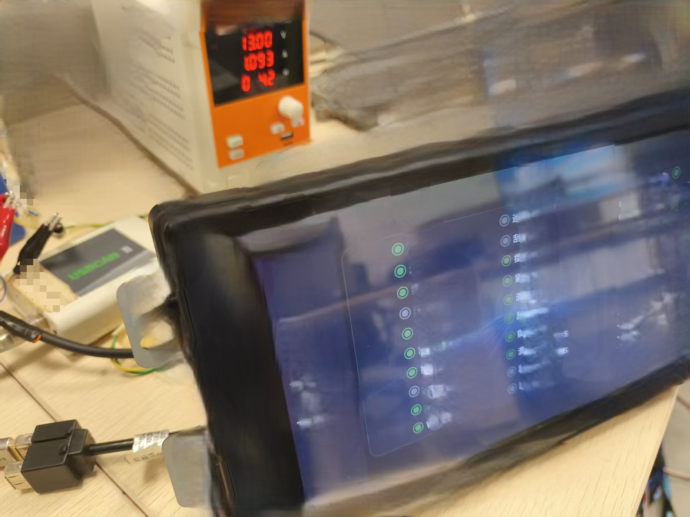
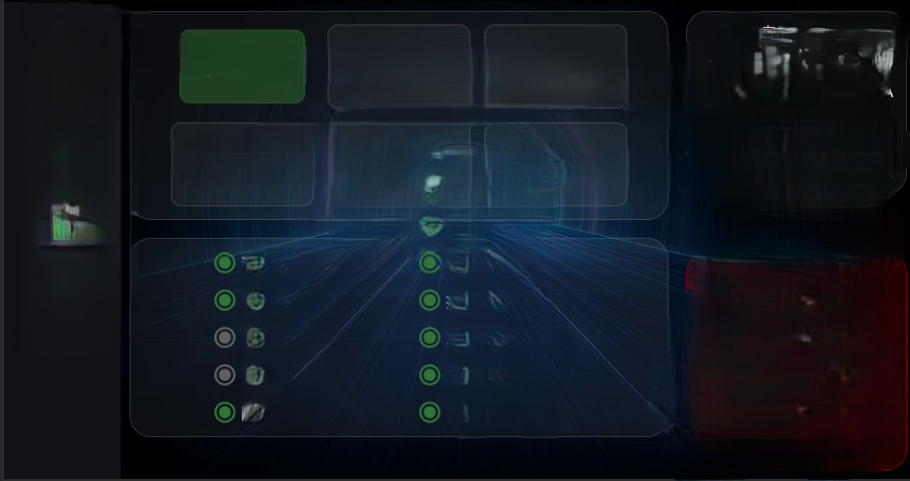
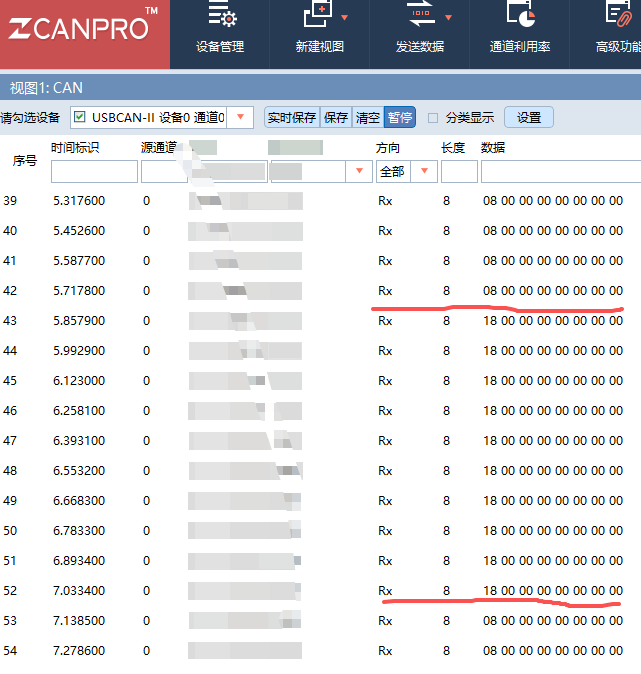

# CAN协议车载通信中间件`smart-dbc`集成手册

## 关于本项目

`smart-dbc` 是一个CAN协议**车载通信中间件**（`Kotlin`/`JVM` 库），提供完整的 **DBC 文件转换、解析、生成、编辑** 能力，并在此基础上封装了一套 **CAN 通信框架**；支持通过注解将数据模型字段与 DBC 信号自动绑定，**实现 CAN 报文的快速编解码 **(从总线值到物理值, 以及从物理值到总线值)。适用于汽车电子、车载网络等需要处理 CAN 总线协议的业务场景。使用`Kotlin`编写，同时兼容 `java`和`kotlin`。

## 行业痛点

在汽车电子行业，**DBC（CAN Database）**是一种文件格式，用于描述 `CAN `总线上的消息和信号的布局规则。简单说，`DBC` 就是 `CAN `通信的"字典"——没有它，你拿到一串 `0x1A2B3C4D...` 的十六进制报文，根本不知道它们代表发动机转速还是车门状态。

行业中处理 `DBC `的痛点很明显：

1. `CANoe `/ `CANalyzer `可以图形化查看，但**无法集成到嵌入式终端**（如车载大屏、TBOX）
2. 部分开源库只支持**读取**，不能编辑并**写回** DBC 文件，并且有的并不支持从`excel`表转换。`Java`这边开源库很少，并且封装程度很低，用起来不顺手。很多只支持上位机和脚本，并不支持车载大屏APP。
3. 做 `CAN` 报文编解码时，每个信号都要**手写移位运算**，几十个信号反复写、容易出错
4. 不同工具链之间 `DBC` 文件的**中文编码不一致**（`CANoe `用 `GBK`，`TSMaster `用 `UTF-8`），互相打开就乱码


------

## 其他开源方案(可选阅读)

**DBC 开源库总览（按语言）**

| 库名                                                         | 语言类型              | DBC 编辑                      | 格式转换                                       | CAN 编解码                                                   |
| ------------------------------------------------------------ | --------------------- | ----------------------------- | ---------------------------------------------- | ------------------------------------------------------------ |
| [cantools](https://github.com/cantools/cantools)             | Python（脚本/上位机） | ✅ 可改信号/消息并写回 dbc     | ⚠️ 主要吃 DBC/KCD/SYM/ARXML，出 DBC             | 🥇 最完整（Motorola/Intel、mux、container、truncated、生成 C 源码） |
| [canmatrix](https://github.com/StaflSystems/canmatrix)       | Python（脚本/上位机） | ✅ 强编辑 + 批量改             | 🥇 最强（DBC/KCD/ARXML/SYM/XLS/LDF/ODX 全互转） | ⚠️ 基础编解码有，拼 payload 得自己补                          |
| [opendbc]([GitHub - commaai/opendbc: a Python API for your car · GitHub](https://github.com/commaai/opendbc)) | Python + C++ 头       | ❌ 不侧重编辑（随车 DBC 为主） | ❌                                              | ✅ Python 侧= cantools；C++ 头嵌 MCU                          |
| [dbcc](https://github.com/dschanoeh/dbcc)                    | C（代码生成器）       | ❌ 编辑靠改源 DBC              | ❌                                              | ✅ DBC→C 编译，零运行时，嵌入式                               |
| [candied](https://github.com/lewiswon/candied)               | TS/JS（前端/Node）    | ✅ 可创建/修改/写回 DBC        | ❌                                              | ✅ 基础编解码齐（字节序/signed/enum），浮点/container 弱      |
| [dbc-can](https://www.npmjs.com/package/dbc-can)             | TS/JS（前端/Node）    | ✅ 链式 API 建 DBC             | ❌                                              | ✅ 加载+编解码                                                |
| [dbc-rs](https://crates.io/crates/dbc-rs)                    | Rust（no_std 可用）   | ❌ 偏解析+编解码               | ❌                                              | ✅ 嵌入式 Rust 编解码齐，forbid unsafe                        |
| [CAN-do-parser](https://github.com/zhiwei55/CAN-do-parser)   | Java（服务端/工具）   | ❌                             | ❌                                              | ✅ byte[] → 物理量                                            |

> **首先，不是重复造轮子。**

由上述表格可见，`python`类的库，功能都挺强大的，可编辑DBC，可格式转换，可CAN编解码；但是这一类主要用于脚本和上位机，对于车载环境无能无力。

但是，业界确实也有`Java`语言的框架，那就是 [CAN-do-parser](https://github.com/zhiwei55/CAN-do-parser)，但是本框架目前已经貌似停止维护了，并且抽象程度和封装程度都很低，和优雅是一点也谈不上，语法还都是面向过程式的，使用起来肯定是不顺手的。

所有就有了本项目，一个使用`kotlin`编写的全新项目，兼容`kotlin`和`java`，拥有完整的 **DBC 文件转换、解析、生成、编辑** 能力，支持 **CAN 报文的快速编解码**，可快速集成在车载大屏APP上(已完成实际验证)。

------

## 应用场景

本框架功能极其强大，应用场景包括但不限于以下：

- **车载大屏APP**：将其部署到车载大屏HMI应用上，快速实现车载CAN通信；
- **DBC编辑**：你可以基于此框架编写UI界面，实现一个类似于`CANdb++`的DBC编辑器
- **Excel转换**：支持将`Excel`格式的CAN协议快速转换为`DBC`文件；
- **上位机/CAN监控**：将本框架集成到你的上位机中，实现类似于`CANoe Trace窗口`的CAN报文监听页面。
- **脚本**：你可以基于本项目编写CAN总线仿真脚本，仿真总线信号。

---

## 环境依赖

| 依赖项 | 版本要求 |
|--------|---------|
| `JDK` | 8+ |
| `Kotlin` | 2.1.0+ |
| `Gradle` | 8.10+（构建用） |

**核心传递依赖**（由 Gradle 自动拉取）：

- `io.github.shilic:smart-grid:1.0.1` — Excel 表格数据读取
- `io.github.shilic:numeric-converter:1.0.2` — 网络字节数据转换
- `org.apache.poi:poi:5.3.0` / `poi-ooxml:5.4.0` — Excel 文件处理
- `com.github.albfernandez:juniversalchardet:2.4.0` — 文件编码自动检测
- `org.jetbrains.kotlin:kotlin-reflect:1.9.0` — 反射支持（注解绑定）
- `com.google.code.gson:gson:2.10.1` — JSON 序列化

---

## 安装与部署

### 添加仓库

`smart-dbc` 发布在 **GitHub Packages**中，需先在 `build.gradle.kts` 中添加仓库：

```kotlin
repositories {
    mavenCentral()
    maven {
        // name : 固定为 GitHubPackages
        name = "GitHubPackages"
        // url : 仓库地址
        url = uri("https://maven.pkg.github.com/shilic/*")
        // 访问令牌
        credentials {
            username = project.findProperty("gpr.user") as String? ?: System.getenv("GITHUB_ACTOR")
            password = project.findProperty("gpr.key") as String? ?: System.getenv("GITHUB_TOKEN")
        }
    }
}
```

> GitHub Packages 要求提供个人访问令牌（classic token，勾选 `read:packages`）。请将令牌配置到环境变量 `GITHUB_TOKEN` 或 `~/.gradle/gradle.properties`文件 中，**切勿提交到仓库**。

### 添加依赖

```kotlin
dependencies {
    // 本框架 smart-dbc  
    implementation("io.github.shilic:smart-dbc:1.0.9")
    // 本框架的传递依赖 smart-grid 
    implementation("io.github.shilic:smart-grid:1.0.1")
    // 本框架的传递依赖 numeric-converter 
    implementation("io.github.shilic:numeric-converter:1.0.2")
}
```

### 克隆源码

如果你需要深度定制，可以克隆源码，自行修改。。

```bash
git clone https://github.com/shilic/smart-dbc.git
cd smart-dbc
./gradlew build
```

---

## 目录结构

本项目有清晰的文件目录划分, 按功能，将框架分为 `dbc`和`can`两大块。测试数据全部在测试项目中，你可以克隆本项目，跑一遍测试项目中的测试用例，以快速了解本项目。

```
smart-dbc/
├── README.md                           // 项目说明
├── build.gradle.kts                    // Gradle 构建配置（依赖、发布）
├── settings.gradle.kts                 // Gradle 项目设置
├── gradle.properties                   // Kotlin 编码风格配置
├── gradlew / gradlew.bat               // Gradle Wrapper
├── gradle/wrapper/                     // Gradle Wrapper 文件（8.10）
│
├── src/main/kotlin/io/github/shilic/smartDbc/
│   ├── can/                            // CAN 运行时框架
│   │   ├── accessors/                  // 信号值与 Kotlin 属性的桥接器
│   │   ├── binds/                      // @CanBinding / @DbcBinding 注解定义
│   │   ├── contract/                   // 框架接口（IMcu、CanListener、CanCopyable）
│   │   ├── core/                       // CanIo 框架入口（单例）
│   │   └── models/canFrame/            // CAN 帧模型（数据帧/远程帧/FD帧）
│   │
│   ├── common/                         // 通用工具
│   │   ├── customComponents/           // 自定义组件（IntEnum 等）
│   │   ├── tool/                       // CAN 工具 / 通用工具函数
│   │   └── typeExtension/              // Kotlin 标准类型扩展函数
│   │
│   ├── dbc/                            // DBC 数据模型与 IO
│   │   ├── attributes/                 // DBC 自定义属性（BA_DEF_ / BA_）
│   │   ├── dataModel/                  // 核心数据模型
│   │   │   ├── contract/              // 只读接口（DataBaseCan / CanMessage / CanSignal）
│   │   │   ├── dataEnums/             // 枚举（字节序、数据类型、帧类型等）
│   │   │   └── models/                // 可变实现类
│   │   └── io/
│   │       ├── reader/                // DBC 文件读取器 / Excel 表格读取器
│   │       └── writer/                // DBC 文件写入器 / 序列化排序器
│   │
│   └── valueConverter/                 // 信号值转换（物理值 ↔ 十六进制）
│
├── src/test/kotlin/
│   ├── canDemo/                        // CAN 框架使用示例（含模拟 MCU）
│   ├── dbcDemo/                        // DBC 文件读写示例
│   ├── demoData/                       // 测试用数据模型
│   └── toolTest/                       // 工具函数测试
│
└── src/test/resources/DBC/             // 测试用 .dbc 文件示例
```

### 架构分层

```
┌──────────────────────────────────────────┐
│          CAN 运行时框架 (can/)            │  ← 注解绑定、报文收发调度
├──────────────────────────────────────────┤
│         值转换层 (valueConverter/)        │  ← 物理值 ↔ 十六进制、Intel/Motorola 位序
├──────────────────────────────────────────┤
│         DBC IO 层 (dbc/io/)              │  ← 文件解析、序列化、Excel 读取
├──────────────────────────────────────────┤
│         DBC 数据模型 (dbc/dataModel/)     │  ← DataBaseCan / CanMessage / CanSignal
└──────────────────────────────────────────┘
```

---

## 快速上手

`smart-dbc` 提供两种基础使用模式（直接模式 / 注解绑定）以及 DBC 文件编辑，将Excel表转换为DBC的能力。下方还有一个完整的 Android Compose UI 实战案例。

### 模式一：直接操作 DBC 对象

适用于快速上手、无需预先定义数据模型的场景。

```kotlin
// 更详细的用法请参考 src/test/kotlin/canDemo/CanTest.kt 文件

// 1. 读取 DBC 文件；DBC对象中使用树形结构保存了DBC文件中的所有信息。
val dbc: DataBaseCan = DbcFileReader({ File("example.dbc").inputStream() }).read()

// 2. 解码 CAN 报文只需一行; 自动将CAN报文解析为物理值，并保存到DBC对应的信号中。
dbc.decodeCanFrame(canFrame)

// 3. 按消息 ID 查看解析结果，内置索引器快速查找报文
dbc[0x18ABAB01]?.also { println(it.valueInfo) }

// 4. 按 (消息ID, 信号名) 精确定位某个信号，使用内置二维索引器简化查找语法
dbc[0x18ABAB01, "msg1_sig1"]?.also {
    println("物理值 = ${it.currentPhyValue}")
    println("文本值 = ${it.currentTextValue}")
}

// 5. 修改信号值并编码发送。内部同时保存了物理值、总线值、文本值3种不同类型的值，给一个赋值可附带同时给其他两个一起赋值。
dbc[0x18ABAB01, "msg1_sig1"]?.currentPhyValue = 10.0
// 快速编码报文。一行代码即可将指定ID的报文转换为CAN帧。
val frame = dbc.encodeCanFrame(0x18ABAB01)
// 调用第三方API模拟发送
mcu.nativeSend(frame)
```

### 模式二：注解绑定（推荐）

适用于已有数据模型的工程，通过注解将字段与 DBC 信号自动关联。适用于更进阶的玩法，例如可以和`Viewmodel`联动。

**第 1 步：定义数据模型**

```kotlin
// 定义一个数据类，用于映射DBC中的报文；在类上使用DbcBinding注解绑定这个数据类属于哪一个DBC
@DbcBinding(["myDbcTag"])
data class Message1(
    // 使用CanBinding注解，绑定这个字段(属性)，映射到DBC文件中的一个信号。
    @CanBinding(0x18ABAB01, "msg1_sig1")
    var msg1sig1: Int = 0,

    @CanBinding(0x18ABAB01, "msg1_sig2")
    var msg1sig2: Double = 0.0,

    // ...更多信号绑定，建议一个数据模型严格绑定DBC中一个ID的报文，实现精准映射。
) : CanCopyable<Message1> {
    // 可选，实现一个克隆接口，kotlin数据类自带克隆，这里只是演示。可以与 Viewmodel 等其他组件联动
    override fun copyNew() = this.copy()
}
```

**第 2 步：初始化框架**

```kotlin
// 更详细的用法请参考 src/test/kotlin/canDemo/MainTest.kt
import io.github.shilic.smartDbc.can.core.CanIo

// 在框架组件CanIo的作用域上调用
CanIo.apply {
    // 注册 DBC
    val dbc = DbcFileReader({ File("example.dbc").inputStream() }).read().apply {
        // 设置DBC标签, 这里需要和数据模型上用DbcBinding绑定的DBC标签一致。
        dbcTag = "myDbcTag"
    }
    // 将 DBC 添加到 DBC 管理器中(绑定DBC, 使其拥有CAN解析的能力)
    dbcMap[dbc.dbcTag] = dbc

    // 绑定数据模型 (需要在绑定DBC之后)（自动反射绑定所有 @CanBinding 字段）
    bind(Message1())
    // 有多个数据模型则反复绑定
    bind(Message2())

    // 注册 MCU 适配器 (使其拥有CAN收发的能力) (需要你自己根据具体的CAN收发组件去实现，通常会是你的嵌入式设备厂家提供这样一个组件给你，你自己适配进来)
    mcuAdapter = MyMcuAdapter
}
```

**第3步：监听报文**

```kotlin
// 更详细的用法请参考 src/test/kotlin/canDemo/MainTest.kt

// 注册 CAN 监听器
CanIo.register(MyListener)
object MyListener : CanListener {
    // 调用函数进行解码，将报文解码到DBC中。
    CanIo.decodeCanFrame(canFrame)
    val msg = CanIo.getModel<Message1>()?.also { println(it) }
    // 如果你使用了 viewmodel ，可以在这里使用刚才获取的数据类对 viewmodel 进行联动。
    // 或者：直接让 viewmodel 实现 CanListener 接口，并将 viewmodel 注册进来。
}
```


**第 4 步：发送报文**

```kotlin
// 直接修改绑定模型的字段值
val msg = CanIo.getModel<Message1>()
msg?.apply {
    msg1sig1 = 15
    msg1sig2 = 22.0
}

// 一条命令完成编码 + 发送 (使用绑定的默认数据类进行发送)
CanIo.transmit(0x18ABAB01)

// 或者指定新的数据类进行报文的发送, 这里就可以和 viewmodel 联动了
val newMsg = msg?.copy (msg1sig1 = 15,msg1sig2 = 16)
CanIo.transmit(0x18ABAB01, newMsg)
```

### DBC 文件编辑

```kotlin
// 读取 DBC 文件, 自动处理 GBK 编码和 UTF-8 编码, 避免文件乱码
val dbc: DataBaseCanImp = DbcFileReader({ File(ExampleDbcPath3).inputStream() }).read()

// 你可以在这里对DBC对象做一些编辑
// 例如添加信号，添加报文，添加自定义属性等等。你可以在此基础之上编写界面，来完成DBC文件的编辑。

// 将DBC对象再次序列化回 .dbc 文件中; 安全写入（自动避免覆盖已有文件）
DbcFileWriter(dbc).safeWrite(ExampleDbcPath3)

```

### Excel转换为DBC

```kotlin
// 同时转换多个Sheet为DBC
val dbcMap : MutableMap<String, DataBaseCanImp> = DbcGridReader({ File(ExampleExcelPath1).inputStream()}).read()

// 又或者使用我封装好的整车协议对象, 用于描述整车协议
val canProtocol: CanProtocolImp = DbcGridReader(ExampleExcelPath1).readProtocol()

// 又或者转换指定 sheet 为 DBC
val dbc: DataBaseCanImp = DbcGridReader(ExampleExcelPath1.workbook()).read(
    sheetName = "CAN1",
    dbcBaseInfo = DbcBaseInfo(
        dbcTag = "CAN1",
        version = "1.0.0",
        dbcComment = "CAN1",
        baudRate = 500
    )
)

// 你可以在这里对DBC对象做一些编辑
// 例如添加信号，添加报文，添加自定义属性等等。你可以在此基础之上编写界面，来完成DBC文件的编辑。
```


---

## 实战案例：Compose UI 集成（Android）

smart-dbc 已在真实的 Android Compose 车载项目（HMI）中完成技术验证。以下是从该项目中提炼的完整集成模式。

### 项目架构总览

```
┌─ Android Tablet ──────────────────────────────────────────┐
│  Jetpack Compose UI                                        │
│  ┌──────────────────────┐  ┌─────────────────────────────┐ │
│  │ MotorStatusScreen    │  │ LoadingPage / StartPage ... │ │
│  └────────┬─────────────┘  └──────────────┬──────────────┘ │
│           │  .collectAsState()            │ .update()       │
│           ▼                               ▼                 │
│  ┌──────────────────────────────────────────────────────┐  │
│  │         CanViewModel (ViewModel + CanListener)       │  │
│  │   MutableStateFlow<RunningStatusMsg>                 │  │
│  │   MutableStateFlow<MainCmdMsg>                       │  │
│  └───────┬──────────────────────────────┬───────────────┘  │
│          │ onListening()                │ transmit()        │
│          ▼                              ▼                   │
│  ┌──────────────────────────────────────────────────────┐  │
│  │                    smart-dbc                          │  │
│  │         CanIo + @CanBinding + DbcFileReader          │  │
│  └──────────────────────┬───────────────────────────────┘  │
│                         │                                   │
│                         ▼                                   │
│  ┌──────────────────────────────────────────────────────┐  │
│  │    McuAdapter (IMcu)  →  硬件 AIDL (xsdmapi.jar)     │  │
│  └──────────────────────────────────────────────────────┘  │
└─────────────────────────────────────────────────────────────┘
```

### 第 1 步：定义数据模型

按接收和发送拆分数据类，一个数据类严格对应 DBC 中一个 ID 的报文：

```kotlin
// 接收模型示例：状态1（30+ 个信号，示例省略部分）
@DbcBinding([DbcTag])
data class Msg1(
    @CanBinding(RunningStatusMsgId, "status1")
    var status1: Int = 0,
    @CanBinding(RunningStatusMsgId, "status2")
    var status2: Int = 0,
    // ... 省略其他 N 个开关量、传感器...
)

// 发送模型示例：指令
@DbcBinding([DbcTag])
data class Cmd1(
    @CanBinding(MainCommandMsgId, "Motor_start")
    var start: Int = 0,
    @CanBinding(MainCommandMsgId, "Motor_stop")
    var stop: Int = 0,
    // ... 省略其他代码
)
```

> **注意**：所有 `@CanBinding` 注解的字段必须声明为 `var`。框架通过反射写入解码值，`val` 字段不会报错但永远接收不到数据。

### 第 2 步：初始化框架

在 `MainActivity` 中异步初始化，DBC 文件放在 Android 的 `assets/dbcs/` 目录下：



```kotlin
fun CanIo.initialize(context: Context) {
    // 1. 从 assets 读取 DBC 文件，自动检测编码
    val dbc = DbcFileReader({ context.assets.open(DbcPath) }).read().apply {
        dbcTag = DbcTag
    }
    dbcMap[DbcTag] = dbc

    // 2. 注册 MCU 适配器
    mcuAdapter = McuAdapter

    // 3. 绑定所有数据模型
    bind(MainCmdMsg())
    bind(SpeedCmdMsg())
    bind(RunningStatusMsg())
    // ... 省略其他绑定
}
```

### 第 3 步：实现 MCU 适配器

将硬件 SDK 的字节数据桥接到 `smart-dbc` 的 `CanFrame`：

这一步骤需要引入CAN卡厂家实现的CAN通信软件包来实现，他们一般在软件包里边实现了一些最基本的CAN收发操作，但是不会给你集成CAN报文的快速编解码；如果是在你的车载大屏上，一般是他们提供一个AIDL封装的组件；如果是在`Windows`上，则一般是一个DLL，例如周立功和同星的二次开发DLL，如需使用本框架，还需要你自己写一层`JNI`来适配（***或许是后续更新方向？***）。

如下图所示，则是车载大屏厂家提供的AIDL工具包。



伪代码如下：

```kotlin
/* 伪代码 */
/* 向上，实现框架需求的 IMcu 接口;  */
object McuAdapter : CAN设备厂家的CAN监听接口, IMcu {
    val canListeners = /* 持有框架需求的CAN监听接口集合 */
    private mcu = /* 向下: 持有CAN设备厂家通过AIDL封装好的mcu组件，在内部通过该组件实现上层接口, 也被成为适配器模式 */
    // CAN设备厂家提供的硬件回调：收到 CAN 原始数据； 非常标准的适配器写法，向上实现框架已有的接口方法。
    override fun onRexxxxxx(/* CAN设备厂家提供的参数，可能是数组格式的报文，而不是对象 */) {
        // 在这里将CAN设备厂家回调的CAN报文转换为框架需求的报文格式
        
        
        // 向下：使用第三方组件实现真正的方法。
        // 解码
        CanIo.decodeCanFrame(canFrame)
        // 通知所有已注册的 CanListener
        canListeners.values.forEach { it.onListening(canFrame) }
    }
    /* 实现注册接口； 非常标准的适配器写法，向上实现框架已有的接口方法。 */
    override fun register(canListener: CanListener) {        
        // 向下：使用第三方组件实现真正的方法。
        mcu.NativeRexxxxxx(canListener)
    }

    // 发送 CAN 帧到硬件
    override fun transmit(canFrame: CanFrame) {
        // 向上，传入框架产生的CAN报文
        
        // 向下，将CAN报文对象转换为CAN设备厂家需求的报文格式，可能是一个数组。        
        mcu?.NativeSendxxxxxxxxx(intArray)
    }
}
```

### 第 4 步：`CanViewModel `桥接 CAN 与 UI

ViewModel 直接实现 `CanListener`，通过 `StateFlow` 将 CAN 数据"翻译"为 Compose 可观察的状态：

```kotlin
/* 伪代码 */
class CanViewModel : ViewModel(), CanListener {
    // ================== 接收侧：N 个 StateFlow（每个报文一个） ==================
    // 非常标准的 一个 ViewModel + StateFlow 的写法，你在网上可以找到大量这样写法的代码
    private val mMsg1 = MutableStateFlow(Msg1())
    val msg1: StateFlow<Msg1> = mMsg1
    private val mMsg2 = MutableStateFlow(Msg2())
    val msg2: StateFlow<Msg2> = mMsg2
    // ... 省略其他 StateFlow ...
    // ================== 发送侧：N 个 StateFlow ==================
    val cmd1= MutableStateFlow(Cmd1())
    val Cmd2   = MutableStateFlow(Cmd2())
    // ... 省略其他 StateFlow ...
    // smart-dbc 解码后回调此方法（运行在 IO 线程）(最终会注册给CAN设备厂家提供的监听函数中)
    override fun onListening(canFrame: CanFrame) {
        when (canFrame.msgId) {
            MsgId1 ->
                msg1.update { CanIo.getModel<Msg1>()!!.copy() }
            MsgId2 ->
                msg2.update { CanIo.getModel<Msg2>()!!.copy() }
            // ... 匹配其他 msgId
        }
    }
    // 周期性发送（100ms 间隔），UI 只需更新 StateFlow，循环自动取最新值
    fun start() {
        // ... 省略
        job = viewModelScope.launch(Dispatchers.IO) {
            while (isActive) {
                CanIo.transmit(Command1MsgId, cmd1.value)
                CanIo.transmit(Command2MsgId, Cmd2.value)
                // ... 省略
                delay(100.milliseconds)
            }
        }
    }
    // 取消报文周期发送
    fun stop() {
        // ... 省略
    }
}
```
关键设计：
- **`.copy()` 深拷贝**：`CanIo.getModel()` 返回框架内部的数据类对象，使用`Kotlin`数据类自带的`.copy()` 生成独立副本供 UI 消费，避免多线程竞争
- **`StateFlow.update {}`**：使用 CAS 保证原子性，安全跨线程
- **周期性发送**：UI 修改 `mainCmd` 的字段值，后台循环自动以固定频率编码并发送，解耦 UI 交互与 CAN 总线时序
### 第 5 步：Compose UI 消费

任何 Composable 函数通过 `.collectAsState()` 即可消费实时 CAN 数据：

```kotlin
/* 伪代码  */
@Composable
fun StatusScreen(can: CanViewModel) {
     // 从 ViewModel 收集 CAN 实时状态
    val runningStatus by can.msg1.collectAsState()
    val motorFault by can.fault.collectAsState()
    // 状态指示灯：绿色=1（到位），灰色=0（未到位）
    SwitchShow("xxxx",  runningStatus.status1 == 1)
    SwitchShow("xxxx", runningStatus.status2 == 1)
    
    // 如果有double类型的物理值，框架将自动处理摩托罗拉格式和英特尔格式，以及精度偏移量。消费值的时候直接使用即可，完全屏蔽解析过程。
    Panel("xxxx", runningStatus.seepd)
    // 故障码：非 0 即故障
    if (motorFault.faultCode1 != 0) FaultShow(motorFault)
}
@Composable
fun CmdScreen(can: CanViewModel) {
    // 从 ViewModel 收集 CAN 实时状态
    val cmd1 by can.cmd1.collectAsState()
    // 用户按下按钮 → 更新 StateFlow → 后台循环自动发送
    BtnItem("启动", onPress = {
        can.cmd1.update(cmd1.copy(
            start = 1,
        ))
    })
}
```

### 第 6 步：MainActivity 启动与销毁

部分代码如下

```kotlin
class MainActivity : ComponentActivity() {
    override fun onCreate(savedInstanceState: Bundle?) {
        super.onCreate(savedInstanceState)
        // 在 IO 线程初始化 CAN
        lifecycleScope.launch(Dispatchers.IO) {
            // 初始化
            CanIo.initialize(this@MainActivity)
            // 注册监听
            CanIo.register(canViewModel)
            // 启动发送循环
            canViewModel.startPeriodicSend()      
        }
        setContent { /* 省略 */ }
    }
    override fun onDestroy() {
        // 清理所有监听器
        CanIo.unRegisterAll()
        // 取消报文周期发送
        canViewModel.stop()
        super.onDestroy()
    }
}
```

---

## `ZCANPRO` 仿真

### 通过 `ZCANPRO` 仿真发送报文, 车载大屏展示数据

如下图所示，在`ZCANPRO` 中导入一个`dbc`文件，该`dbc`文件也是通过基于本框架实现的`DBC`转换器用`excel`协议表转换而来。

使用`ZCANPRO` 模拟发送报文。



在设备端，我们连接好模拟电源，CAN卡，车载大屏，以及USB的调试端口。如下图所示，界面成功按照`ZCANPRO` 中的报文进行了显示，验证无误。



### 通过车载大屏按键发送报文, `ZCANPRO` 模拟接收

在车载大屏上，我们按下按键，则模拟发送报文。



如下图`ZCANPRO`的仿真面板所示，按下按键之后，相关报文自动变为1，松开后，报文则自动变为0 。



## 功能特性

- ✅ 完整的 `DBC `关键字解析：`VERSION`、`BU_`、`BO_`、`SG_`、`CM_`、`VAL_`、`BA_DEF_`、`BA_DEF_DEF_`、`BA_`、`BO_TX_BU_`
- ✅ **自动检测文件编码（`GBK` / `UTF-8`），避免打开文件时乱码(`TSMaster`使用`utf-8`编码, `CANoe`使用`GBK`编码, 他们互相打开编辑时会乱码)**
- ✅ 支持 `Intel`、`Motorola MSB`、`Motorola LSB` 三种字节序
- ✅ 支持 `Standard (11-bit)` 和 Extended (29-bit) CAN ID
- ✅ **支持 `CAN FD` 帧**
- ✅ 自定义 DBC 属性读写和创建（五种值类型：INT / FLOAT / STRING / ENUM / HEX）
- ✅ **`Excel` 表格导入 `DBC` 协议定义（通过 `smart-grid`）**
- ✅ **完全解耦CAN通信层和应用层，任何CAN通信协议的变化都不需要修改应用层代码，每层各自独立更新，互不影响。更新CAN通信协议，只需要重新导入DBC文件即可。**
- ✅ 注解驱动的数据模型绑定（`@CanBinding` / `@DbcBinding`）
- ✅ **`Kotlin` 只读/可变接口分离，遵循 `Kotlin` 设计哲学**
- ✅ 安全的文件写入（自动生成不重名文件，避免覆盖）

---

## 版本更新

### V1.0.10 (2026.7.3)

- 优化：将部分语法改成`kotlin`风格, 使用默认参数, 并将函数参数放最后一个位置。

### V1.0.9 (2026.7.2)

- 适配了Excel协议转换为DBC文件的功能

### v1.0.7 (2026-6-25)

- 在安卓的 `Compose UI`上完成了技术验证
- 修复了诸多BUG

### v1.0.0（2026-06-16）

- 新增：完整的 DBC 文件解析与生成
- 新增：CAN 报文编解码（Intel / Motorola 字节序）
- 新增：注解驱动的数据模型绑定框架
- 新增：Excel 表格导入 DBC 协议
- 新增：自定义 DBC 属性支持
- 新增：CAN FD 帧支持
- 首次正式发布

---

## 常见问题（FAQ）

**Q: 为什么拉取依赖时报 401/403？**

A: GitHub Packages 需要认证。请确保已在环境变量或 `~/.gradle/gradle.properties` 中配置了有效的 GitHub 个人访问令牌（classic token，需勾选 `read:packages` 权限）。

**Q: DBC 文件中文注释乱码？**

A: 读取器内置了自动编码检测（通过 `juniversalchardet`），会自适应 GBK 或 UTF-8 编码。如果仍有问题，请确认 DBC 源文件的实际编码。

**Q: 支持哪些 DBC 版本？**

A: 支持标准 DBC 格式，涵盖 `VERSION ""`、`BU_:`、`BO_`、`SG_`、`CM_`、`VAL_`、`BA_DEF_`、`BA_DEF_DEF_`、`BA_`、`BO_TX_BU_` 等全部常用关键字。

**Q: Motorola 格式的信号值不对？**

A: 请确认 DBC 中信号的字节序定义是否正确（Motorola 为 `0`，Intel 为 `1`）。框架内部已实现 Motorola 的 zigzag 位布局解析。

---

## 版权与许可

本项目基于 [Apache License 2.0](LICENSE) 开源，详见 [LICENSE](LICENSE) 文件。

---

## 作者

- **诚（shilic）** — [https://github.com/shilic](https://github.com/shilic)
- 邮箱：985478238@qq.com

---

## 贡献指南

欢迎提交 Issue 和 Pull Request。

- 报告 Bug：请在 Issue 中附上 DBC 文件片段、CAN报文和复现步骤
- 功能建议：欢迎在 Issue 中描述使用场景
- 代码贡献：请先开 Issue 讨论方案，再提交 PR
