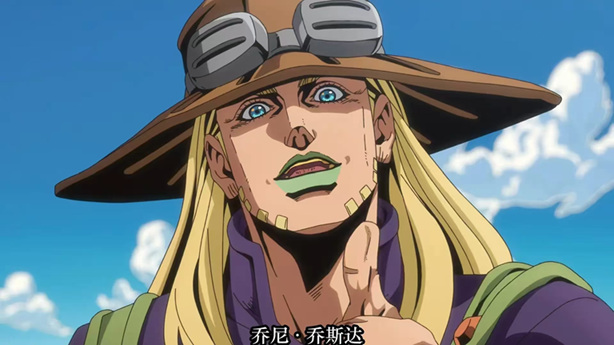
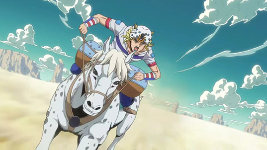

# JOJO飙马野郎中的箴言1

> [!NOTE]
>
> 乔尼：杰洛，你赢不了迪亚哥。

<!-- more -->

> [!TIP]
>
> 杰洛：……你在说些什么？
>

> [!NOTE]
>
> 乔尼：第一段、第二段，你本来都能赢。技术不差，战术也不差，可最后输的都是你。这不是运气问题。
>

> [!TIP]
>
> 杰洛：那是什么？
>

> [!NOTE]
>
> 乔尼：你的东西，是“继承”来的。铁球、处刑人的技术、对那不勒斯王室的忠义、参加这场比赛的缘由——全都是别人交给你的。你是“继承者”。
>

> [!TIP]
>
> 乔洛：继承者又怎样？
>

> [!NOTE]
>
> 乔尼：迪亚哥不一样。他的一切都是自己抢来的。贫穷、失去母亲、被人踩在脚下——这些东西没有打倒他，反而让他“想要”。他输了就什么都没了，所以他会饿，会咬，会不择手段地往上爬。他是“饥渴者”，是“掠夺者”。
>

> [!TIP]
>
> 杰洛：……所以你是说，我像个靠前辈和门第吃饭的人？
>

> [!NOTE]
>
> 乔尼：我没说你坏。继承者不一定卑鄙，饥渴者也不一定正当。可是这场横跨美洲的大赛不讲漂亮话。在最后被逼到绝境的那一瞬，“有没有那股非赢不可的饥渴”会露出来。而这股差距，会一口一口吃掉你的胜利。
>

> [!TIP]
>
> 杰洛：……
>

> [!NOTE]
>
> 乔尼：不把饥渴亮出来，就赢不了他。但你不能变成迪亚哥。你必须比他更高洁，同时又得比他更饿。不然你永远摸不到真正的顶点。
>

> [!TIP]
>
> 杰洛：你说什么……
>

> [!NOTE]
>
> 乔尼：我要回岸上走大路了。你爱渡水就渡吧。
>

