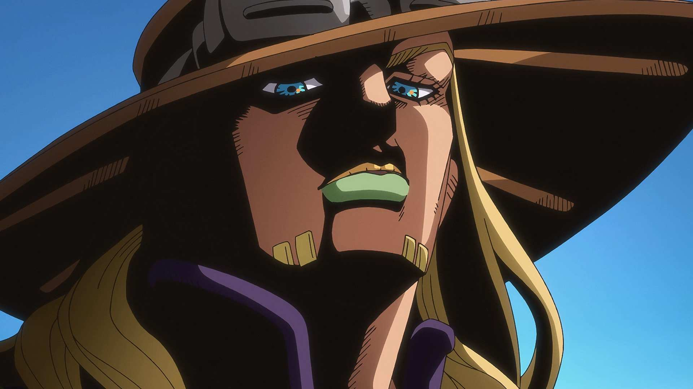
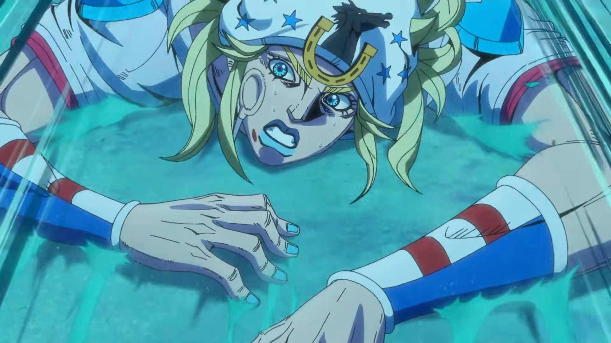

# JOJO飙马野郎中的箴言2

> [!NOTE]
>
> 杰洛：我们追不上总统了……别再管遗体了，再追下去你会死。

<!-- more -->

> [!TIP]
>
> 乔尼：可是我的腿……碰到铁球、碰到遗体的时候，它动过了。
>
> 我这种人，本来早就该完蛋了。
>
> 从哥哥死那天起，我就一直觉得自己是“负数”——
>
> 是我害的，是我该死，命运在罚我。
>
> 可遗体让我站起来了。
>
> 哪怕只有一瞬间，也不是“惩罚”，是别的东西在回应我。

> [!IMPORTANT]
>
> 乔尼：所以我不在乎了。
>
> 活还是死，都无所谓。
>
> 谁是正义、谁是邪恶，这种事无所谓。
>
> 什么圣人不圣人、遗体能救多少人，我也无所谓！
>
> 我现在还停在“负数”。
>
> 我想回到零。
>
> 只要拿到遗体，我就能把这份负数，拉回零——！

<BiliBili bvid="BV1Q34y1a7Hw" />

[https://www.bilibili.com/video/BV1Q34y1a7Hw](https://www.bilibili.com/video/BV1Q34y1a7Hw)

